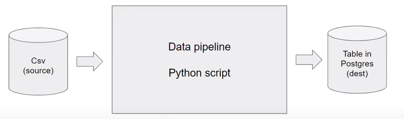
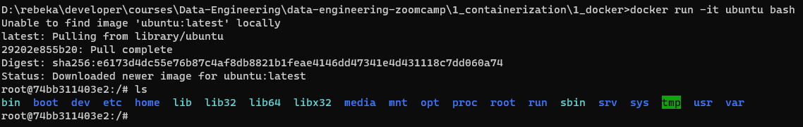
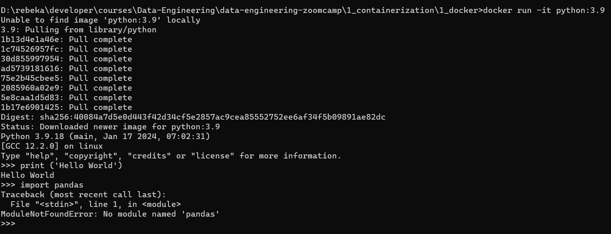
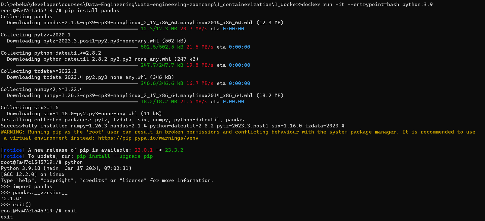
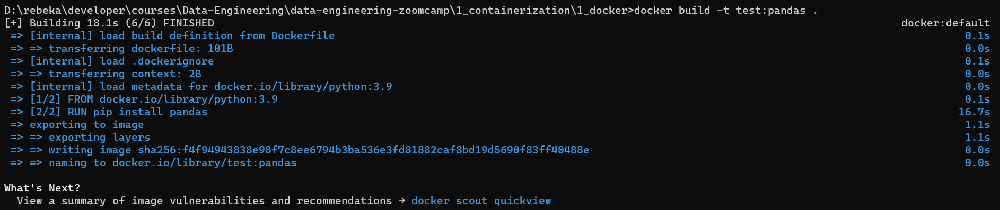
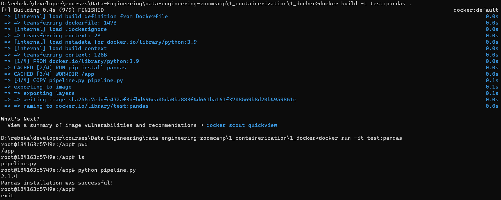
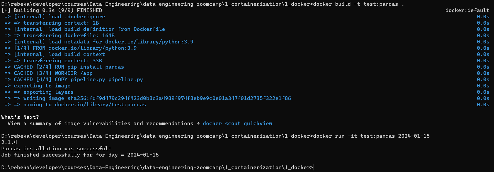

# Docker

**Docker** is a set of platform as a service products that use OS-level virtualization to deliver software in packages called *containers.* Containers are *isolated* from one another and bundle their own software, libraries, and configuration files; they can communicate with each other through well-defined channels.

**Data pipeline:** input data → process data → output data



If we run a data pipeline inside a container it is virtually isolated from the rest of the things running on the computer.

Docker allows to run multiple databases and multiple operations in isolated environment inside the same host computer without creating conflict.

An advantage of docker is reproducibility, which allows us to create a docker image which is a snapshot of our environment that contains instructions to set up an isolated docker environment. We can run the container we have created through the docker image where we have specified and configured the environment beyond the host computer and essentially everywhere like - Google Cloud (Kubernetes), AWS Batch etc. Docker Image ensures reproducibility regardless of the machine as the images are identical. We can specify OS, programming languages, packages, database type, tools etc.

**Why care about Docker?**
1. Local experiments
2. Integration tests (CI/CD)
3. Reproducibility
4. Running pipelines on the cloud (AWS Batch, Kubernetes jobs)
5. Spark
6. Serverless (AWS Lambda, Google Functions)


# Setting up Docker

[Install docker on Mac](https://docs.docker.com/desktop/install/mac-install/)

[Install docker on Windows](https://docs.docker.com/desktop/install/windows-install/)

[Install docker on Linux](https://docs.docker.com/desktop/install/linux-install/)

## docker run

Once we have installed docker we can test if docker is installed properly by running the following command in the terminal: `docker run hello-world`

This will
- Go to **Docker Hub**, which contains all the images
- Look for the image called **hello-world**
- Once found docker will download the required packages and run the image
- This is a pre-installed docker image to test if docker is running properly


Let's run another command, `docker run -it ubuntu bash`, where:
- `run` means we want to run this image
- `it` means interactive mode
- `ubuntu` is the name of the image we want to run
- `bash` is the command we want to execute in this image

Now we have a containerized linux commandline inside the host computer.



We can do something stupid like run `rm -rf /` inside the container. This will delete everything from the operating system we just created. Once executed we won't even be able to run the command `ls` inside the container because it does not exist.

To exit a container, run the `exit` command.

If we run the command `docker run -it ubuntu bash` again followed by `ls`, we will see the files again. This proves that containerization protects the host computer from stupidity.

Let's run another command, `docker run -it python:3.9`, where:
- `python` is the name of the image we want to run
- `3.9` is a tag (of a specific version)

This runs Python 3.9 in an isolated container in interactive mode. When we run the command, it open the Python interactive shell where we can write Python code.



Unfortunately we cannot install any Python packages using `pip` inside the interactive shell. To use `pip` we have to be in a command line shell. By exiting the Python interactive shell we also exit the container. Instead, if we run the command `docker run -it --entrypoint=bash python:3.9`, it opens a bash prompt which allows us to use `pip` as we usually do. After installing the necessary packages we can run the `python` command to get into the Python interactive shell and import the packages we just installed. Enter `Ctrl+D` to exit Python interactive shell,and enter `Ctrl+D` again to exit the container.



Now if we again execute `docker run -it --entrypoint=bash python:3.9`, enter Python interactive shell, and import pandas, it throws `ModelNotFoundError`. This happens because when we run this command, we run this container at the state before `pandas` was installed. The `Python:3.9` image does not have `pandas`. To solve this, we need to configure the images with a **Dockerfile**.

## Dockerfile & docker build

> Dockerfile
```docker
FROM python:3.9

RUN pip install pandas

ENTRYPOINT ["bash"]
```

- `FROM` declares the kind of base image we want to use
- `RUN` declares the command we want to run in the command line as soon the base image is set
- `ENTRYPOINT` declares the entry point for the docker image using a list as an argument

To create a container from the **Dockerfile** run the command: `docker build -t test:pandas .` where:
- `build` builds an image from the Dockerfile
- `--tag , -t` name and optionally a tag in the 'name:tag' format
- `test` is the name of the image
- `pandas` is the image tag
- `.` builds the image in the same directory



After `docker build` builds the image from **Dockerfile**, we can run the container from the image with: `docker run -it test:pandas`


## Running a script in a container

We can also create a Python script and run it in the docker container.

> pipeline.py
```python
import pandas

print(pandas.__version__)
print('Pandas installation was successful!')
```

We need to modify the Dockerfile.

> Dockerfile
```docker
FROM python:3.9

RUN pip install pandas

WORKDIR /app
COPY pipeline.py pipeline.py

ENTRYPOINT ["bash"]
```
- `WORKDIR /app` is the working directory where the file **pipeline.py** is copied to
- `COPY A B` A is the name of source file in the host machine to be copied and B is the name of the destination file in the image

To override the previous image we need to rebuild the container using `docker build -it test:pandas .`



A few things to notice:
- Packages are installed from cache
- We can verify the current working directory by running `pwd`. In this case the current working directory is */app* and we are automatically `cd`ed into it.
- We can verify the presence of **pipeline.py** by running `ls`. We can run it using `python pipeline.py`

## Passing arguments into a script

We can add scheduling to a pipeline and have it run on specific days.

> pipeline.py
```python
import sys
import pandas

print(pandas.__version__)
print('Pandas installation was successful!')

# sys.argv allows to pass arguments to the script from the commandline
# sys.argv[0] is name of the file
# sys.argv[1] is first argument passed
day = sys.argv[1]

print(f"Job finished successfully for day = {day}")
```

We also need to modify the `ENTRYPOINT` in Dockerfile to make sure we run **pipeline.py** using *python* as soon as we run the container.

> Dockerfile
```docker
FROM python:3.9

RUN pip install pandas

WORKDIR /app
COPY pipeline.py pipeline.py

ENTRYPOINT ["python", "pipeline.py"]
```

Rebuild the container using `docker build -it test:pandas .`

Run the container using `docker run -it test:pandas . 2024-01-15`



- *2024-01-15* is the argument passed into **pipeline.py**
- Running the container passes the argument from command line into **pipeline.py**, runs the script and exits the container