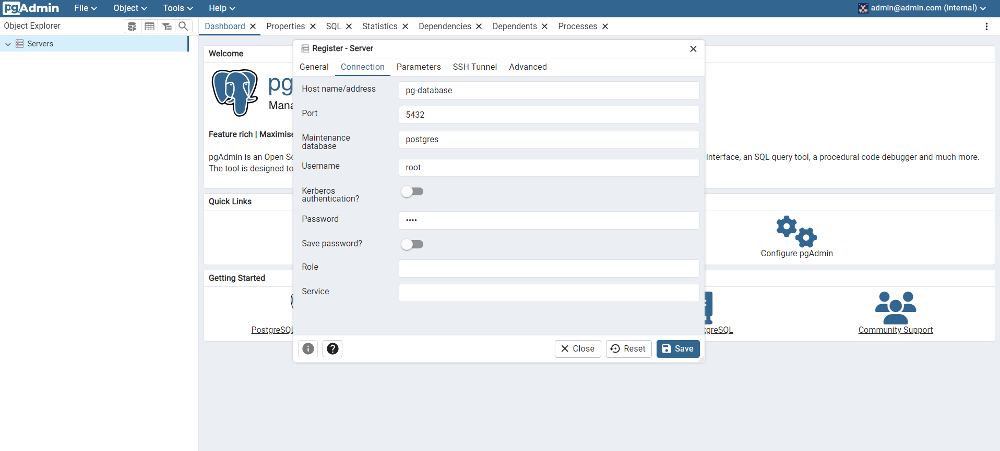
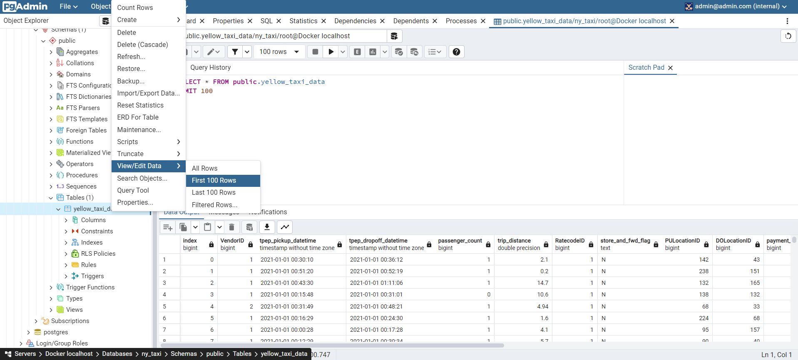
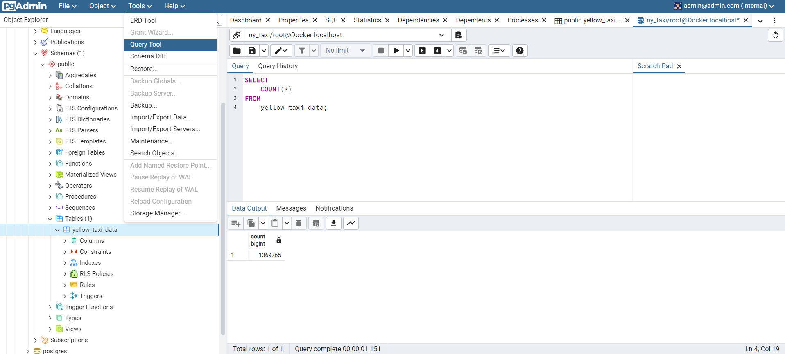

# Connecting pgAdmin and Postgres

`pgcli` is a commandline interface to take a quick look at the data, but it is not convenient. Instead, we are going to use `pgAdmin`. It is a web-based GUI tool used to interact with the Postgres database sessions, both locally and remote servers as well.

## Installing pgAdmin

Instead of installing pgAdmin directly we can use docker to install pgAdmin container. Instruction for running the container can be found [here](https://www.pgadmin.org/docs/pgadmin4/latest/container_deployment.html).

Run the following command in the command line:

```bash
docker run -it \
    -e PGADMIN_DEFAULT_EMAIL="admin@admin.com" \
    -e PGADMIN_DEFAULT_PASSWORD="root" \
    -p 8080:80 \
    dpage/pgadmin4
```

`docker run -it -e PGADMIN_DEFAULT_EMAIL="admin@admin.com" -e PGADMIN_DEFAULT_PASSWORD="root" -p 8080:80 dpage/pgadmin4`

- Port mapping: We map a port (8080) on our host machine to a port (80) on the container. All the request sent to port 8080 on the host machine will be forwarded to port 80 on the container.

## Running pgAdmin

Once the container is initialized, go to **localhost:8080** on a web browser. Use the email and password from the docker run command to sign in.

pgAdmin cannot communicate with Postgres database because they are running in separate isolated containers. We will need to connect both the containers in one network. This is done by **Docker Network Create**.

First, stop both the containers and exit them.

## Docker Network Create

To create a network called **pg-network** run the following command in the command line: `docker network create pg-network`

Now, run the modified docker run command for Postgres in the command line:

```bash
docker run -it \
    -e POSTGRES_USER="root" \
    -e POSTGRES_PASSWORD="root" \
    -e POSTGRES_DB="ny_taxi" \
    -v D:/rebeka/developer/courses/data-engineering-zoomcamp/code/1_docker/ny_taxi_postgres_data:/var/lib/postgresql/data \
	-p 5432:5432 \
    --network=pg-network \
    --name pg-database \
    postgres:13
```

`docker run -it -e POSTGRES_USER="root" -e POSTGRES_PASSWORD="root" -e POSTGRES_DB="ny_taxi" -v D:/rebeka/developer/courses/data-engineering-zoomcamp/code/1_docker/ny_taxi_postgres_data:/var/lib/postgresql/data -p 5432:5432 --network=pg-network --name pg-database postgres:13`

- `pg-network` is the name of the docker network
- `pg-database` is the name used by pgAdmin to discover the database

After running the command it should show that *"database system is ready accept connections"*

Next, run the modified docker run command for pgAdmin in another command line window:

```bash
docker run -it \
    -e PGADMIN_DEFAULT_EMAIL="admin@admin.com" \
    -e PGADMIN_DEFAULT_PASSWORD="root" \
    -p 8080:80 \
    --network=pg-network \
    --name pgadmin \
    dpage/pgadmin4
```

`docker run -it -e PGADMIN_DEFAULT_EMAIL="admin@admin.com" -e PGADMIN_DEFAULT_PASSWORD="root" -p 8080:80 --network=pg-network --name pgadmin dpage/pgadmin4`

Now, go to **localhost:8080** and use the email and password from the docker run command to sign in.

We need to create a new server called `Docker localhost` with the correct database name. In the `Connection` tab add:
- Host name = `pg-database`
- Port = `5432`
- Maintainence database = `postgres`
- Username = `root`
- Password = `root`



## Using pgAdmin

**First 100 Rows**

left-click `Servers` on the left menu> `Docker localhost` > `Databases` > `ny_taxi` > `Schemas` > `public` > `Tables` > `yellow_taxi_data` > right-click `View/Edit Data` > `First 100 Rows`



**Writing Queries**

left-click `Tools` on the top menu > `Query Tool`

