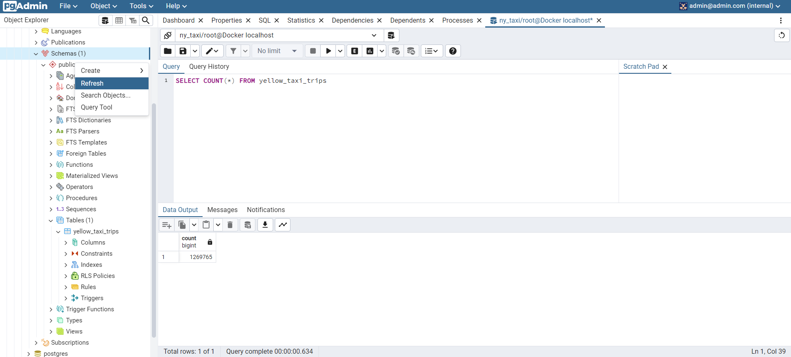

# Dockerizing the Ingestion Script

## Converting a Notebook to a Python script

We can use `jupyter` to convert an existing notebook to a Python script using the following command: `jupyter nbconvert --to=script upload-data.ipynb`

Remove the unnecessary parts of the script and name it `ingest_data.py`

## Using `argparse` to parse command line arguments

We can use the `argparse` library to parse command line arguments instead of `sys.argv`. We want to pass the following arguments:
- username
- password
- host
- port
- database name
- table name
- URL of the CSV

The `os.system` function allows us to run terminal commands from inside a Python Script. The `-O` argument outputs the file we downloaded using `wget` to the `output.csv` file.

See [ingest_data.py](../code/1_docker/ingest_data.py)

## Dropping the table

To drop the table *yellow_taxi_data*, run the command `DROP TABLE yellow_taxi_data`

Now the database table is empty and running the command `SELECT COUNT(*) FROM yellow_taxi_data` returns an error that the relation *yellow_taxi_data* does not exist.

## Running the script

Run the following command in the command line:

```bash
URL="<https://github.com/DataTalksClub/nyc-tlc-data/releases/download/yellow/yellow_tripdata_2021-01.csv.gz>"

python ingest_data.py \
  --user=root \
  --password=root \
  --host=localhost \
  --port=5432 \
  --db=ny_taxi \
  --table_name=yellow_taxi_trips \
  --url="${URL}"
```

`python ingest_data.py --user=root --password=root --host=localhost --port=5432 --db=ny_taxi --table_name=yellow_taxi_trips --url="https://github.com/DataTalksClub/nyc-tlc-data/releases/download/yellow/yellow_tripdata_2021-01.csv.gz"`

- Make sure we have `wget` installed on the host machine.
- Here we are declaring the URL variable and later accessing the variable with `${URL}` in the terminal.
- We have changed the table name from *yellow_taxi_data* to *yellow_taxi_trips*.
- This is not the safest way to pass passwords since the passwords can be retrieved from command line history (by running the `history` command.) A better way to pass passwords is to use an environment variables or password stores.

Next, refresh the database from pgAdmin by right-clicking on `Schemas` and clicking on `Refresh`. We should be able to see the table *yellow_taxi_trips*. We can verify that that command has run successfully by running the query `SELECT COUNT(*) FROM yellow_taxi_trips`.



## Dockerizing the ingestion script

To dockerize the ingestion script, modify the **Dockerfile** as shown below:

> Dockerfile

```docker
FROM python:3.9.1

RUN apt-get install wget
RUN pip install pandas sqlalchemy psycopg2

WORKDIR /app
COPY ingest_data.py ingest_data.py

ENTRYPOINT ["python", "ingest_data.py"]
```
To build the container from the **Dockerfile** run the command: `docker build -t taxi_ingest:v001 .`

Next, we need to run the image instead of the Python script. To do this, we need to first add the `network` argument and change the `host` argument from localhost to the database name.

```bash
docker run -it \
  --network=pg-network \
  taxi_ingest:v001 \
  --user=root \
  --password=root \
  --host=pg-database \
  --port=5432 \
  --db=ny_taxi \
  --table_name=yellow_taxi_trips \
  --url="${URL}"
```

`docker run -it --network=pg-network taxi_ingest:v001 --user=root --password=root --host=pg-database --port=5432 --db=ny_taxi --table_name=yellow_taxi_trips --url="https://github.com/DataTalksClub/nyc-tlc-data/releases/download/yellow/yellow_tripdata_2021-01.csv.gz"`

We can kill a container by:
- First running the `docker ps` command to get a list of docker containers
- Then identifying the `Container ID Port` for the docker image we want to kill, and then running `docker kill <container_id_insert_here>`

After configing the **Dockerfile**, building the image, and running the container from the image, we have two containers connected by one network. We can check pgAdmin for the status of the database.