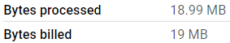
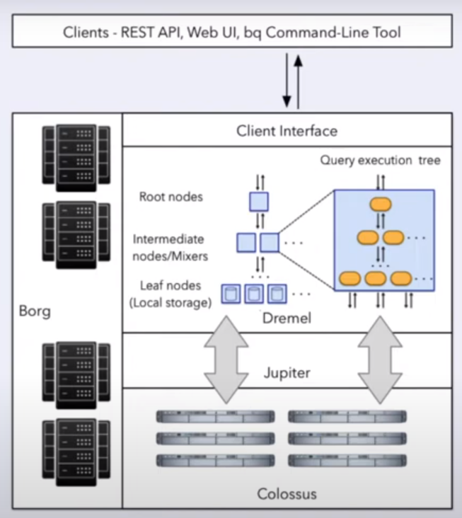

# OLAP vs OLTP

| | OLTP | OLAP |
|---|---|---|
| Meaning | Online Transaction Processing | Online Analytical Processing |
| Purpose | Control and run essential business operations in real time | Plan, solve problems, support decisions, discover hidden insights|
| Data updates | Short, fast updates initiated by user | Data periodically refreshed with scheduled, long-running batch jobs |
| Database design | Normalized databases for efficiency | Denormalized databases for analysis |
| Space requirements | Generally small if historical data is archived | Generally large due to aggregating large datasets |
| Backup and recovery | Regular backups required to ensure business continuity and meet legal and governance requirements | Lost data can be reloaded from OLTP database as needed in lieu of regular backups |
| Productivity | Increases productivity of end users | Increases productivity of business managers, data analysts, and executives |
| Data view | Lists day-to-day business transactions | Multi-dimensional view of enterprise data |
| User examples | Customer-facing personnel, clerks, online shoppers | Knowledge workers such as data analysts, business analysts, and executives |

# Data Warehouse

A **Data Warehouse** is an OLAP solution that is used for reporting and data analysis. Data warehouses can provide access to raw data, summary data or data marts.


# BigQuery

- BigQuery is a serverless data warehouse solution. There are no servers to manage or database software to install.
- It provides software as well as infrastructure with scalability and high-availability.
- Built-in features include:
    - Machine learning
    - Geospatial analysis
    - Business intelligence
- It maximizes flexibility by separating the compute engine from storage.

### Pricing

**On demand pricing**
- 1 TB of data processed is $5

**Flat rate pricing**
- Based on number of pre requested slots
- 100 slots → $2,000/month = 400 TB data processed on demand pricing

## Querying publicly available data

BigQuery provides a lot of open source public data. We will query the `citibike_stations` table.

Navigate to **Google Cloud** > **BigQuery**.

BigQuery caches data. We should uncheck this to ensure consistent results by navigating to **Create SQL query** > **More** > **Query settings**.

```sql
-- querying publicly available data
SELECT station_id, name
FROM bigquery-public-data.new_york_citibike.citibike_stations
LIMIT 100;
```

Copy the above query into the console and click on **Run**.

## Creating external tables

An external data source is a data source that you can query directly from BigQuery, even though the data is not stored in BigQuery storage. For example, you might have data in a different Google Cloud database, in files in Cloud Storage, or in a different cloud product altogether that you would like to analyze in BigQuery, but that you aren't prepared to migrate.

- External tables are similar to standard BigQuery tables, in that these tables store their metadata and schema in BigQuery storage. However, their data resides in an external source.
- External tables are contained inside a dataset, and you manage them in the same way that you manage a standard BigQuery table.
- There are three kinds of external tables:
    - BigLake tables
    - Object tables
    - Non-BigLake external tables

To create an external table, run the following query:

```sql
-- creating external table referring to gcs path
CREATE OR REPLACE EXTERNAL TABLE `fleet-furnace-412302.ny_taxi.external_yellow_tripdata`
OPTIONS (
  format = 'PARQUET',
  uris = ['gs://mage-zoomcamp-rebekam/nyc_taxi_data/tpep_pickup_date=2021-*/7e7ee24868404f349eea3e7bbe9bf16c-0.parquet']
);
```
- `fleet-furnace-412302` is the project id
- `ny_taxi` is the BQ schema
- `external_yellow_tripdata` is the name of the table to be created in BQ
- `mage-zoomcamp-rebekam` is the Google Storage bucket name
- `*` can be used to reference multiple URIs in the same location

If we navigate to the **Details** tab and scroll down to **Storage info**, we will see that there is no information about `Number of rows` or `Table size`. This is because when we create an external table, BigQuery is not able to determine its rows or the table size it is going to cost because the data is not inside BigQuery. It is in an external system (Google Cloud Storage.)

To query the external table, run:

```sql
-- check yellow trip data
SELECT * FROM `fleet-furnace-412302.ny_taxi.external_yellow_tripdata` limit 10;
```

## Partitioning

When we create a dataset, we generally have one or more columns that are used as some type of filter. We can partition a table based on such columns to improve BigQuery's performance by improving efficiency and reducing querying costs. If we query for only one parition, BigQuery does not need to read the other partitions.


- We can partition by:
    - Time-unit column
    - Ingestion time (_PARTITIONTIME)
    - Integer range
- When using Time-unit or Ingestion time, we can select between:
    - Daily (default)
    - Hourly
    - Monthly
    - Yearly
- Number of partitions limit is 4000

To create a non-partitioned table from an external table, run the following query:

```sql
CREATE OR REPLACE TABLE fleet-furnace-412302.ny_taxi.yellow_tripdata_non_partitoned AS
SELECT *,
DATE(TIMESTAMP_MICROS(CAST (tpep_pickup_datetime/1000 AS INT64))) AS tpep_pickup_date
FROM fleet-furnace-412302.ny_taxi.external_yellow_tripdata;
```

To create a partitioned table from an external table, run the following query:

```sql
-- create a partitioned table from external table
CREATE OR REPLACE TABLE fleet-furnace-412302.ny_taxi.yellow_tripdata_partitoned
PARTITION BY
  tpep_pickup_date AS
SELECT *,
DATE(TIMESTAMP_MICROS(CAST (tpep_pickup_datetime/1000 AS INT64))) AS tpep_pickup_date
FROM fleet-furnace-412302.ny_taxi.external_yellow_tripdata;
```
- We are partitioning the table by the column `tpep_pickup_date`
- The **PARTITION BY** function only accepts `DATE` or `TIMESTAMP`, not `INT64`. `tpep_pickup_datetime` is in UNIX timestamp so I had to convert it into a `YYYY-mm-dd` date format first and store it in `tpep_pickup_date`. 
- If we navigate to the **Details** tab and scroll down to **Storage Info**, we will see that the `Number of rows`, `Number of partitions`, and size fields are now populated.

To see the advantage of partitioning, run the following two queries:

```sql
SELECT DISTINCT(VendorID)
FROM fleet-furnace-412302.ny_taxi.yellow_tripdata_non_partitoned
WHERE tpep_pickup_date BETWEEN '2021-01-01' AND '2021-01-30';

SELECT DISTINCT(VendorID)
FROM fleet-furnace-412302.ny_taxi.yellow_tripdata_partitoned
WHERE tpep_pickup_date BETWEEN '2021-01-01' AND '2021-01-30';
```
- We can see the performance in **Query results** > **JOB INFORMATION**
- Running the query with the non-partitioned data processes **18.99 MB**

- Running the query with the partitioned data processes **18.55 MB**


To look closer into the partitions, run:

```sql
SELECT table_name, partition_id, total_rows
FROM `ny_taxi.INFORMATION_SCHEMA.PARTITIONS`
WHERE table_name = 'yellow_tripdata_partitoned'
ORDER BY total_rows DESC;
```


## Clustering

We can also cluster tables based on a field. Clustering also helps to reduce cost and improve query performance. The field that we choose for clustering depends on how the data will be queried.


- Columns specified are used to co-locate related data
- The order of the column is important
- The order of the specified columns determine the sort order of the data
- Clustering improves:
    - Filter queries
    - Aggregate queries
- Clustering columns must be top-level and non-repeated columns. They can be one of the following types:
    - DATE
    - BOOL
    - GEOGRAPHY
    - INT64
    - NUMERIC
    - BIGNUMERIC
    - STRING
    - TIMESTAMP
    - DATETIME
- Table with data size < 1 GB, don't show significant improvement with partitioning and clustering
- Number of clusters limit is 4

To create a partitioned and clustered table from an external table, run the following query:

```sql
-- create a partition and cluster table from external table
CREATE OR REPLACE TABLE fleet-furnace-412302.ny_taxi.yellow_tripdata_partitoned_clustered
PARTITION BY tpep_pickup_date
CLUSTER BY VendorID AS
SELECT *,
DATE(TIMESTAMP_MICROS(CAST (tpep_pickup_datetime/1000 AS INT64))) AS tpep_pickup_date
FROM fleet-furnace-412302.ny_taxi.external_yellow_tripdata;
```
- If we navigate to the **Details** tab, we will see that the table is **Partitioned by** `DAY` and **Clustered by** `VendorID`.

To see the advantage of clustering, run the following two queries:

```sql
SELECT count(*) as trips
FROM fleet-furnace-412302.ny_taxi.yellow_tripdata_partitoned
WHERE tpep_pickup_date BETWEEN '2021-01-01' AND '2021-01-30'
  AND VendorID=1;

SELECT count(*) as trips
FROM fleet-furnace-412302.ny_taxi.yellow_tripdata_partitoned_clustered
WHERE tpep_pickup_date BETWEEN '2021-01-01' AND '2021-01-30'
  AND VendorID=1;
```
- Running the query with the non-partitioned data processes **18.55 MB**

- Running the query with the partitioned data processes **17.75 MB**


### Partitioning vs. Clustering

| Clustering | Partitioning |
|---|-----|
| Cost benefit unknown | Cost known upfront |
| You need more granularity than partitioning alone allows | You need partition-level management |
| Your queries commonly use filters or aggregation against multiple columns | Filter or aggregate on single column |
| The cardinality of the number of values in a column or group of columns is large | |

### When to use clustering over partitioning?

- Partitioning results in a small amount of data per partition (approximately less than 1 GB)
- Partitioning results in a large number of partitions beyond the limits on partitioned tables
- Partitioning results in your mutation operations modifying the majority of partitions in the table frequently (for example, every few minutes)

### Automatic reclustering

As data is added to a clustered table
- The newly inserted data can be written to blocks that contain key ranges that overlap with the key ranges in previously written blocks
- These overlapping keys weaken the sort property of the table

To maintain the performance characteristics of a clustered table
- BigQuery performs automatic re-clustering in the background to restore the sort property of the table
- For partitioned tables, clustering is maintained for data within the scope of each partition.

## BigQuery best practices

- Cost reduction
    - Avoid `SELECT *` and instead specify column names
    - Price queries before running them
    - Use clustered or partitioned tables
    - Use streaming inserts with caution
    - Materialize query results in stages
- Query performance
    - Filter on partitioned columns
    - Denormalizing data
    - Use nested or repeated columns
    - Use external data sources appropriately
    - Don't use it, in case we want a high query performance
    - Reduce data before using a JOIN
    - Do not treat WITH clauses as prepared statements
    - Avoid oversharding tables
- Query performance
    - Avoid JavaScript user-defined functions
    - Use approximate aggregation functions (HyperLogLog++)
    - Order last, for query operations to maximize performance
    - Optimize join patterns
    - As a best practice, place the table with the largest number of rows first, followed by the table with the fewest rows, and then place the remaining tables by decreasing size

## Internals of BigQuery



- **Colossus:** Google's distributed file storage that stores data in a columnar format. Colossus is separated from computation. Thus, it is generally cheap.

- **Jupiter:** since compute and storage are in different hardware, Google needs a very fast network for communication. Jupiter is the network that is implemented inside Google's data center and has ~1TB bandwidth.


- **Dremel:** the query execution engine. Dremel breaks each query into a tree structure, whose parts are executed in parallel across several nodes.


- **Column-oriented storage:** type of storage that is optimized for querying subsets of columns from tables. It is also efficient for performing filtering or aggregation functions over columns.

## Machine Learning in BigQuery


To build a Linear Regression model to predict `tip_amount` in BigQuery, see [bigquery_machine_learning.sql](../code/5_bigquery/bigquery_machine_learning.sql).

### Model deployment

- gcloud auth login
- Export the project into Google Cloud Storage: `bq --project_id fleet-furnace-412302 extract -m ny_taxi.tip_model gs://taxi_ml_model/tip_model`
- Create a directory for the model: `mkdir /tmp/model`
- Copy the model from Google Cloud Storage to our model directory: `gsutil cp -r gs://taxi_ml_model/tip_model /tmp/model`
- Create a serving directory: `mkdir -p serving_dir/tip_model/1`
- Copy all model data into the serving directory: `cp -r /tmp/model/tip_model/* serving_dir/tip_model/1`
- Pull Tensorflow serving docker image: `docker pull tensorflow/serving`
- Run the docker image: `docker run -p 8501:8501 --mount type=bind,source=pwd/serving_dir/tip_model,target= /models/tip_model -e MODEL_NAME=tip_model -t tensorflow/serving &`
- Check if the docker image is running: `docker ps`
- `curl -d '{"instances": [{"passenger_count":1, "trip_distance":12.2, "PULocationID":"193", "DOLocationID":"264", "payment_type":"2","fare_amount":20.4,"tolls_amount":0.0}]}' -X POST http://localhost:8501/v1/models/tip_model:predict`
- Use POSTMAN to make HTTP requests: http://localhost:8501/v1/models/tip_model

## Documentation

[BigQuery under the hood](https://cloud.google.com/blog/products/bigquery/bigquery-under-the-hood)

[BigQuery explained: An overview of BigQuery's architecture](https://cloud.google.com/blog/products/data-analytics/new-blog-series-bigquery-explained-overview)

[Dremel: Interactive Analysis of Web-Scale Datasets](http://static.googleusercontent.com/media/research.google.com/en//pubs/archive/36632.pdf)

[BigQuery ML Tutorials](https://cloud.google.com/bigquery-ml/docs/tutorials)

[BigQuery ML Reference Parameter](https://cloud.google.com/bigquery-ml/docs/analytics-reference-patterns)

[Hyper Parameter tuning](https://cloud.google.com/bigquery-ml/docs/reference/standard-sql/bigqueryml-syntax-create-glm)

[Feature preprocessing](https://cloud.google.com/bigquery-ml/docs/reference/standard-sql/bigqueryml-syntax-preprocess-overview)

[Export a BigQuery ML model for online prediction](https://cloud.google.com/bigquery/docs/export-model-tutorial)