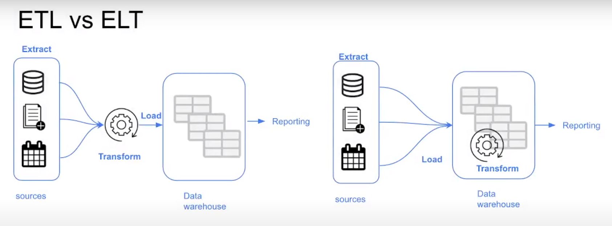

# Analytics Engineering

- **Data Engineer**: prepares and maintains the infrastructure for the data teams.
- **Analytics Engineer**: introduces good software engineering practices to the efforts of data analysts and data scientists.
- **Data Analysts**: uses data to solve business problems.

### Analytics Engineering Tools:
- **Data Loading**: Fivetran, Stitch
- **Data Storing**: Cloud Data Warehouses like Snowflake, BigQuery, Redshift
- **Data Modeling**: dbt, Dataform
- **Data Presentation**: BI tools like Google Data Studio, Looker, Mode, Tableau

## Data Modeling Concepts

### ETL vs ELT

| ETL | ELT |
|---|---|
| Slightly more stable and compliant data analysis| Faster and more flexible data analysis |
| Higher storage and compute costs | Lower cost and lower maintainance |

### Kimball's Dimensional Modeling

**Objective**:
- Deliver data understandable to the business users
- Deliver fast query performance

**Approach**:
Prioritize user understandability and query performance over non redundant data (3NF)

### Elements of Dimensional Modeling

**Fact tables**:
- Fact = Measures
- Typically numeric values which can be aggregated, such as measurements or metrics. Examples: sales, orders, etc.
- Corresponds to a business process
- Can be thought of as "verbs"

**Dimension tables**:
- Dimension = Context
- Groups of hierarchies and descriptors that define the facts. Example: customer, product, etc.
- Corresponds to a business entity
- Provides context to a business process
- Can be thought of as "nouns"

Dimensional Modeling is built on a star schema with fact tables surrounded by dimension tables.

### Architecture of Dimensional Modeling

A good way to understand the architecture of Dimensional Modeling is by drawing an analogy between dimensional modeling and a restaurant:

- Stage Area (food storage):
    - Contains the raw data
    - Not meant to be exposed to everyone
- Processing area (kitchen):
    - From raw data to data models
    - Focuses in efficiency and ensuring standards
- Presentation area (dining hall):
    - Final presentation of the data
    - Exposure to business stakeholder