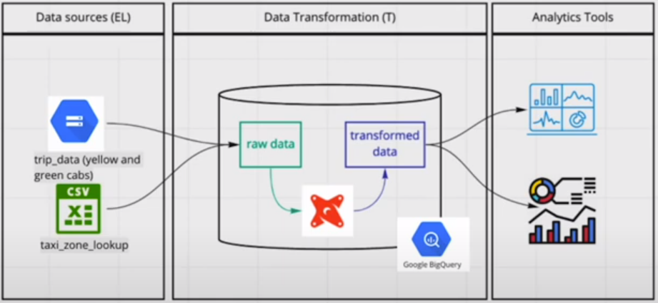
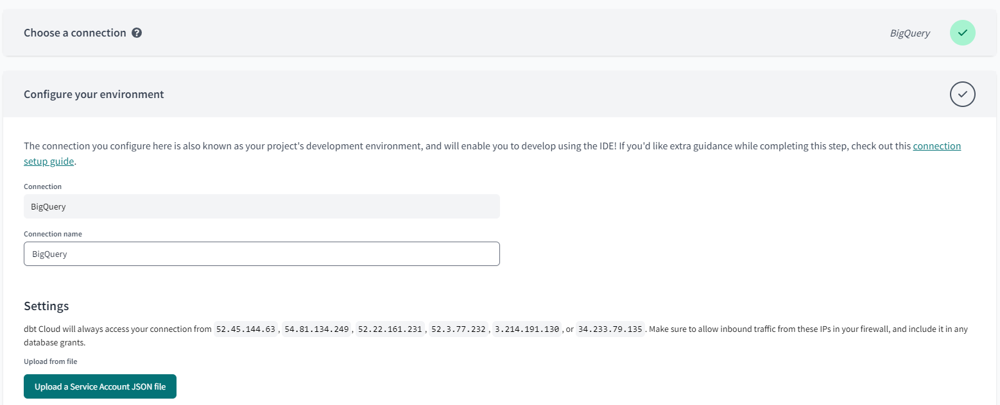

# dbt

**dbt** (data build tool) is a transformation workflow that allows anyone that knows SQL to deploy analytics code following software engineering best practices like modularity, portability, CI/CD, and documentation.


dbt works by defining a **modeling layer** that sits on top of the Data Warehouse. The modeling layer turns tables into **models**, then transforms them into **derived models**, which are then persisted in the Data Warehouse.

Each model is:
- A sql file
- Select statement (no DDL or DML)
- A file that dbt will compile and run in the Data Warehouse

### How to use dbt?

- **dbt Core**: open-source project that allows the data transformation
    - Builds and runs a dbt project (.sql and .yaml files)
    - Includes SQL compilation logic, macros and database adapters
    - Includes a CLI interface to run dbt commands locally
    - Open-source and free to use
- **dbt Cloud**: SaaS application to develop and manage dbt projects
    - Web-based IDE to develop, run and test a dbt project
    - Jobs orchestration
    - Logging and alerting
    - Intregrated documentation
    - Free for individuals (one developer seat)

### How are we going to use dbt?

- **BigQuery**:
    - Development using Cloud IDE
    - No local installation of dbt Core

- **Postgres**:
    - Development using local IDE of choice
    - Local installation of dbt Core connecting to the Postgres database
    - Running dbt models through the CLI



## Starting a dbt Project (using BigQuery and dbt Cloud)

### Create a BigQuery service account

In the Google Cloud console, navigate to **APIs & Services** > **Credentials** > **Help me choose** from the left hamburger menu. Select **BigQuery API** and **Application data** and then click **Next**.


Continue to create a service account called `dbt-service-account`and add the following roles to grant this service account access to project and then click **Done**:
- **BigQuery** > **BigQuery Admin**


For increased security, we can also choose to grant specific roles (**BigQuery Data Editor**, **BigQuery Job User**, **BigQuery User**) the account will need. In this case we also need to add viewer role to avoid encountering denied access errors.

Now that the service account has been created we need to add and download a JSON key. Click on the service account > **KEYS** tab > **ADD KEY** > **Create new key** > select **JSON** key type > **CREATE**. A key will be downloaded to our machine.

### Create a dbt cloud project

Create a dbt user account by going to [dbt homepage](https://www.getdbt.com/) and signing up for a free account.

Non-enterprise account can have only one project. Navigate to **Account** > **Projects** to edit the name of the project.

Choose **BigQuery** as the data warehouse.
- Upload the key we just downloaded from BigQuery in the create from file option. This will fill out most fields related to the production credentials.
- Scroll down to the end of the page and set up the development credentials.
- Click on **Test Connection** > **Next**.




Finally, add a GitHub repository. Navigate to **Account** > **Projects** to specify the project subdirectory.

Navigate to **Develop** tab on the top to view the project.

dbt does not allow us to work on the main branch after this, hence we need to create a new branch.

Click on the green **Initialize** button to create the project files for the starter project.

Edit **dbt_project.yml** as follows:
- Change the project name in the `name` field and in the `models:` block below
- Delete the `example` block in the end

## Building a dbt model

### Anatomy of a dbt model

dbt models are written in SQL (remember that a dbt model is essentially a `SELECT` query). dbt does the DDL and DML for us but we have to tell dbt how to create the DDL and DML.

In the following example we are telling dbt that the `my_model` has to be materialized as a `table` in the database. This will tell dbt how to compile the code.

> my_model.sql
```sql
{{
    config(materialized='table')
}}

SELECT *
FROM staging.source_table
WHERE record_state = 'ACTIVE'
```

dbt will compile this code into the following SQL query:

```sql
CREATE TABLE my_schema.my_model AS (
    SELECT *
    FROM staging.source_table
    WHERE record_state = 'ACTIVE'
)
```

After the code is compiled, dbt will run the compiled code in the Data Warehouse.

### Materializations in dbt Cloud

- `ephemeral`: Ephemeral materializations are temporary and exist only for the duration of a single dbt run. In this strategy a SQL CTE is created.
- `view`: Views are virtual tables created by dbt that can be queries like regular tables. In this strategy the model is rebuilt as a SQL view on each run.
- `table`: Tables are physical representations of data that are created and stored in the database. In this strategy the model is rebuilt as a table on each run.
- `incremental`: Incremental materializations are a powerful feature of dbt that allow for efficient updates to existing tables, reducing the need for full data refreshes. This strategy allows us to add or update records incrementally rather than rebuilding the complete table on each run.
- Custom strategies can be defined for advanced cases.

### The FROM clause of a dbt model

The `FROM` clause within a `SELECT` statement defines the **source** of the data to be used.

- **Sources**:
    - The data loaded to our data warehouse that we use as sources for our models
    - We can access this data with the `source()` function
    - Configuration is defined in the `yml` files in the model folder
    - The `sources` key in the `yml` file contains the details of the databases that the `source()` function can access and translate into proper SQL-valid names
    - Used with the source macro that will resolve the name to the right schema, plus build the dependencies automatically
    - Source freshness can be defined and tested to check whether a source is "fresh" or "stale" and if the data pipelines are working properly
- **Seeds**:
    - CSV files stored in our repository under the **seed** folder
    - Benefits of version controlling
    - Equivalent to a `COPY` command
    - Recommended for static data that doesn't change frequently
    - Runs with `dbt seed -s file_name`
- **Ref**:
    - Macro to reference the underlying tables and views that were building the data warehouse
    - Run the same code in any environment, it will resolve the correct schema
    - Dependencies are built automatically

### Creating a dbt model

In the project, create a new file called **schema.yml** under **models/staging/** folder. Add the following code to the file:

> schema.yml
```yaml
version: 2

sources:
  - name: staging
    database: fleet-furnace-412302
    schema: trips_data_all

    tables:
      - name: green_taxi
      - name: yellow_taxi
```
On saving the file, we should be able to see the sources in the **Lineage** tab.

Next click on `Generate model` above the `green_taxi` table. This should open a file called **stg_staging__green_taxi.sql** under **models/staging/staging** folder.


dbt creates the source as follows:

```sql
source as (

    select * from {{ source('staging', 'green_taxi') }}

),
```
- The first argument of the `source()` function is the source name, and the second is the table name

Save the file **stg_staging__green_taxi.sql**. Move it to under **models/staging/** folder and rename it to **stg_green_taxi.sql**.

To build the whole project run `dbt build` in the terminal at the bottom. dbt runs a few tests.


Now delete the **models/examples/** folder.

### Macros

**Macros** are pieces of code in Jinja that can be reused, similar to functions in other languages.

Macros allow us to add features to SQL that aren't otherwise available, such as:
* Use control structures such as `if` statements or `for` loops.
* Use environment variables in our dbt project for production.
* Operate on the results of one query to generate another query.
* Abstract snippets of SQL into reusable macros.

dbt already includes a series of macros like `config()`, `source()` and `ref()`, but custom macros can also be defined.

Macros are defined in separate `.sql` files which are typically stored in a `macros` directory.

There are 3 kinds of Jinja _delimiters_:
- `` for **statements** (control blocks, macro definitions)
- `{{ ... }}` for **expressions** (literals, math, comparisons, logic, macro calls...)
- `{# ... #}` for comments.

In the project, create a new file called **get_payment_type_description.sql** under the **macros** folder and add the following code:

> macros/get_payment_type_description.sql
```sql
{#
    This macro returns the description of the payment_type 
#}



    case {{ dbt.safe_cast("payment_type", api.Column.translate_type("integer")) }}  
        when 1 then 'Credit card'
        when 2 then 'Cash'
        when 3 then 'No charge'
        when 4 then 'Dispute'
        when 5 then 'Unknown'
        when 6 then 'Voided trip'
        else 'EMPTY'
    end


```
- The `macro` keyword states that the line is a macro definition. It includes the name of the macro as well as the parameters.
- The code of the macro itself goes between 2 statement delimiters. The second statement delimiter contains an `endmacro` keyword.
- In the code, we can access the macro parameters using expression delimiters.
- The macro returns the **code** we've defined rather than a specific value.

We can use this macro in **stg_green_taxi.sql** as follows:

> models/staging/stg_green_taxi.sql
```sql
with 
source as (
    select * from {{ source('staging', 'green_taxi') }}
),
renamed as (
    select
        ...
        payment_type,
        {{ get_payment_type_description('payment_type') }} as payment_type_description,
        ...
    from source
)
select * from renamed
```

If we compile **stg_green_taxi.sql**, this would be converted to:

```sql
with
source as (
    select * from `fleet-furnace-412302`.`trips_data_all`.`green_taxi`
),
renamed as (
    select
        ...
        payment_type,
        case 
    safe_cast(payment_type as INT64)
  
        when 1 then 'Credit card'
        when 2 then 'Cash'
        when 3 then 'No charge'
        when 4 then 'Dispute'
        when 5 then 'Unknown'
        when 6 then 'Voided trip'
        else 'EMPTY'
    end as payment_type_description,
        ...
    from source
)
select * from renamed
```
- The macro is replaced by the code contained within the macro definition as well as any variables that we may have passed to the macro parameters.

### Packages

Macros can be exported to **packages**, similarly to how classes and functions can be exported to libraries in other programming languages.
- Packages contain standalone dbt projects with models and macros that tackle a specific problem area.
- When we add a package to our project, the package's models and macros become part of our own project.
- Packages are created in a file called `packages.yml` in the root of the work directory and imported by running `dbt deps`.
- A list of useful packages can be found in the [dbt package hub](https://hub.getdbt.com/).

Create a new file called `packages.yml` in the root of the work directory and add the following code:

> packages.yml
```yaml
packages:
  - package: dbt-labs/dbt_utils
    version: 1.1.1
```
- `dbt deps` should run automatically, but if not we can run it from the terminal.

To use the `dbt utils` package, add the following code in **stg_green_taxi.sql**:

> models/staging/stg_green_taxi.sql
```sql
with 
source as (
    select * from {{ source('staging', 'green_taxi') }}
),
renamed as (
    select
        {{ dbt_utils.generate_surrogate_key(['vendorid', 'lpep_pickup_datetime']) }} as tripid,
        vendorid,
        ...
    from source
)
select * from renamed
```
- The `surrogate_key()` macro generates a hashed surrogate key with the specified fields in the arguments.

We can now **compile** and then **build** the project.

Now if we navigate to **Google Cloud** console > **BigQuery**, we should be able to see a **dataset** called `dbt_rmukherjee` and the `stg_green_taxi` model under that. We should be able to see a field called `tripid`.


### Variables

Like most other programming languages, **variables** can be defined and used across our project.
- With the `var()` macro, dbt allows us to provide data to models for compilation
```sql


    limit 100


```
- To use a variable we use the `{{ var('...') }}` function
- Variables can be defined in 2 different ways:
    - In the `dbt_project.yml` file
    ```yaml
    vars:
        payment_type_values: [1, 2, 3, 4, 5, 6]
    ```
    - In the command line as arguments when building or running the project
    ```sh
    dbt build --m <your-model.sql> --var 'is_test_run: false'
    ```

In this example, the default value for `is_test_run` is `true`; in the absence of a variable definition either on the `dbt_project.yml` file or when running the project, then `is_test_run` would be `true`. Since we passed the value `false` when runnning `dbt build`, then the `if` statement would evaluate to `false` and the code within would not run.

Now, change the code in the file **stg_green_taxi.sql** to the following:

> models/staging/stg_green_taxi.sql
```sql
{{ config(materialized='view') }}

with tripdata as 
(
  select *,
    row_number() over(partition by vendorid, lpep_pickup_datetime) as rn
  from {{ source('staging', 'green_taxi') }}
  where vendorid is not null 
)
select
    -- identifiers
    {{ dbt_utils.generate_surrogate_key(['vendorid', 'lpep_pickup_datetime']) }} as tripid,
    {{ dbt.safe_cast("vendorid", api.Column.translate_type("integer")) }} as vendorid,
    {{ dbt.safe_cast("ratecodeid", api.Column.translate_type("integer")) }} as ratecodeid,
    {{ dbt.safe_cast("pulocationid", api.Column.translate_type("integer")) }} as pickup_locationid,
    {{ dbt.safe_cast("dolocationid", api.Column.translate_type("integer")) }} as dropoff_locationid,
    
    -- timestamps
    cast(timestamp_micros(cast (lpep_pickup_datetime/1000 as INT64)) as timestamp) as pickup_datetime,
    cast(timestamp_micros(cast (lpep_dropoff_datetime/1000 as INT64)) as timestamp) as dropoff_datetime,
    
    -- trip info
    store_and_fwd_flag,
    {{ dbt.safe_cast("passenger_count", api.Column.translate_type("integer")) }} as passenger_count,
    cast(trip_distance as numeric) as trip_distance,

    -- payment info
    cast(fare_amount as numeric) as fare_amount,
    cast(extra as numeric) as extra,
    cast(mta_tax as numeric) as mta_tax,
    cast(tip_amount as numeric) as tip_amount,
    cast(tolls_amount as numeric) as tolls_amount,
    cast(improvement_surcharge as numeric) as improvement_surcharge,
    cast(total_amount as numeric) as total_amount,
    coalesce({{ dbt.safe_cast("payment_type", api.Column.translate_type("integer")) }},0) as payment_type,
    {{ get_payment_type_description("payment_type") }} as payment_type_description
from tripdata
where rn = 1

-- dbt build --select <model_name> --vars '{'is_test_run': 'false'}'


  limit 100


```

If we build this model, we should be able to see `limit 100` at the end of the query in the **Details** tab.

In order to not add `limit 100`, we should run `dbt build --select stg_green_taxi --vars '{'is_test_run': 'false'}'`

Now create a new file called **stg_yellow_taxi.sql** under the **models/staging/** folder for the `yellow_taxi` model. Add the following code:

> models/staging/stg_yellow_taxi.sql
```sql
{{ config(materialized='view') }}
 
with tripdata as 
(
  select *,
    row_number() over(partition by vendorid, tpep_pickup_datetime) as rn
  from {{ source('staging', 'yellow_taxi') }}
  where vendorid is not null 
)
select
   -- identifiers
    {{ dbt_utils.generate_surrogate_key(['vendorid', 'tpep_pickup_datetime']) }} as tripid,    
    {{ dbt.safe_cast("vendorid", api.Column.translate_type("integer")) }} as vendorid,
    {{ dbt.safe_cast("ratecodeid", api.Column.translate_type("integer")) }} as ratecodeid,
    {{ dbt.safe_cast("pulocationid", api.Column.translate_type("integer")) }} as pickup_locationid,
    {{ dbt.safe_cast("dolocationid", api.Column.translate_type("integer")) }} as dropoff_locationid,

    -- timestamps
    cast(timestamp_micros(cast (tpep_pickup_datetime/1000 as INT64)) as timestamp) as pickup_datetime,
    cast(timestamp_micros(cast (tpep_dropoff_datetime/1000 as INT64)) as timestamp) as dropoff_datetime,
    
    -- trip info
    store_and_fwd_flag,
    {{ dbt.safe_cast("passenger_count", api.Column.translate_type("integer")) }} as passenger_count,
    cast(trip_distance as numeric) as trip_distance,
    
    -- payment info
    cast(fare_amount as numeric) as fare_amount,
    cast(extra as numeric) as extra,
    cast(mta_tax as numeric) as mta_tax,
    cast(tip_amount as numeric) as tip_amount,
    cast(tolls_amount as numeric) as tolls_amount,
    cast(improvement_surcharge as numeric) as improvement_surcharge,
    cast(total_amount as numeric) as total_amount,
    coalesce({{ dbt.safe_cast("payment_type", api.Column.translate_type("integer")) }},0) as payment_type,
    {{ get_payment_type_description('payment_type') }} as payment_type_description
from tripdata
where rn = 1

-- dbt build --select <model.sql> --vars '{'is_test_run: false}'


  limit 100


```

### Using dbt seed

Download [Taxi Zone Lookup Table](https://s3.amazonaws.com/nyc-tlc/misc/taxi+_zone_lookup.csv) and copy its contents into a new file called **taxi_zone_lookup.csv** under the folder **seeds**.

If we now **build** this, it should create a seed file called `taxi_zone_lookup`.

Next, create a new file called **dim_zone.sql** under **models/core** folder and add the following code:

> models/core/dim_zone.sql
```sql
{{ config(materialized='table') }}

select 
    locationid, 
    borough, 
    zone, 
    replace(service_zone,'Boro','Green') as service_zone 
from {{ ref('taxi_zone_lookup') }}
```
- This model references the `taxi_zone_lookup` table created from the taxi zone lookup CSV seed.
- The `ref()` macro is used for referencing any underlying tables and views that we've created, so we can reference seeds as well as models using this macro.

Next, create a new file called **fact_trips.sql** under **models/core** folder and add the following code:

> models/core/fact_trips.sql
```sql
{{ config(materialized='table') }}

with green_tripdata as (
    select *, 
        'Green' as service_type
    from {{ ref('stg_green_taxi') }}
), 
yellow_tripdata as (
    select *, 
        'Yellow' as service_type
    from {{ ref('stg_yellow_taxi') }}
), 
trips_unioned as (
    select * from green_tripdata
    union all 
    select * from yellow_tripdata
), 
dim_zones as (
    select * from {{ ref('dim_zones') }}
    where borough != 'Unknown'
)
select trips_unioned.tripid, 
    trips_unioned.vendorid, 
    trips_unioned.service_type,
    trips_unioned.ratecodeid, 
    trips_unioned.pickup_locationid, 
    pickup_zone.borough as pickup_borough, 
    pickup_zone.zone as pickup_zone, 
    trips_unioned.dropoff_locationid,
    dropoff_zone.borough as dropoff_borough, 
    dropoff_zone.zone as dropoff_zone,  
    trips_unioned.pickup_datetime, 
    trips_unioned.dropoff_datetime, 
    trips_unioned.store_and_fwd_flag, 
    trips_unioned.passenger_count, 
    trips_unioned.trip_distance, 
    trips_unioned.fare_amount, 
    trips_unioned.extra, 
    trips_unioned.mta_tax, 
    trips_unioned.tip_amount, 
    trips_unioned.tolls_amount, 
    trips_unioned.improvement_surcharge, 
    trips_unioned.total_amount, 
    trips_unioned.payment_type, 
    trips_unioned.payment_type_description
from trips_unioned
inner join dim_zones as pickup_zone
on trips_unioned.pickup_locationid = pickup_zone.locationid
inner join dim_zones as dropoff_zone
on trips_unioned.dropoff_locationid = dropoff_zone.locationid
```
- The models we've created in the **staging area** are for normalizing the fields of both green and yellow taxis. With normalized field names we can now join the 2 together in more complex ways.

Now the lineage should look like this (modular data modeling):


Since dbt has already identified the connections, we can click on `Built +model+` to build the model as well as all of its parents and children. In this case we don't have any children of `fact_trips` yet, but this should still work.

This processes only a limited amount of data because the table have `limit 100`. If we want to run this on all the data in production, we need to run `dbt build --select +fact_trips+ --vars '{'is_test_run': 'false'}'`

## Testing dbt models

Tests in dbt are assumptions that we make about our data.
- In dbt, tests are essentially a `SELECT` query that will return the amount of records that fail because they do not follow the assumption defined by the test.
- Tests are defined on a column in the model YAML files.
- dbt provides a few predefined tests to check if column values are unique, not null, accepted values or a foreign key to another table.
- Custom tests can also be created as queries.

Create a new file called **dm_monthly_zone_revenue.sql** under the **models/core** folder and add the following code:

> models/core/dm_monthly_zone_revenue.sql
```sql
{{ config(materialized='table') }}

with trips_data as (
    select * from {{ ref('fact_trips') }}
)
    select 
    -- Reveneue grouping 
    pickup_zone as revenue_zone,
    {{ dbt.date_trunc("month", "pickup_datetime") }} as revenue_month, 

    service_type, 

    -- Revenue calculation 
    sum(fare_amount) as revenue_monthly_fare,
    sum(extra) as revenue_monthly_extra,
    sum(mta_tax) as revenue_monthly_mta_tax,
    sum(tip_amount) as revenue_monthly_tip_amount,
    sum(tolls_amount) as revenue_monthly_tolls_amount,
    sum(improvement_surcharge) as revenue_monthly_improvement_surcharge,
    sum(total_amount) as revenue_monthly_total_amount,

    -- Additional calculations
    count(tripid) as total_monthly_trips,
    avg(passenger_count) as avg_montly_passenger_count,
    avg(trip_distance) as avg_montly_trip_distance

    from trips_data
    group by 1,2,3
```

Then, add the package `codegen` to **packages.yml**. Run `dbt deps` if it does not run automatically on saving the file.

> packages.yml
```yaml
  - package: dbt-labs/codegen
    version: 0.12.1
```

Next, open a new file, add the following code and compile it. It should generate the model yaml.

```

{{ codegen.generate_model_yaml(
    model_names = models_to_generate
) }}
```

Copy everything in the `model` block of the output and paste it into `schema.yml`.

In `dbt_project.yml` add a variable called `payment_type_values` by adding the following code:

```yaml
vars:
  payment_type_values: [1, 2, 3, 4, 5, 6]
```

Now we can add some tests by changing `schema.yaml` as follows:

> models/staging/schema.yml
```yaml
  - name: stg_green_taxi
    description: ""
    columns:
      - name: tripid
        data_type: string
        description: ""
        tests:
          - unique:
              severity: warn
          - not_null:
              severity: warn
```
```yaml
      - name: pickup_locationid
        data_type: int64
        description: ""
        tests:
          - relationships:
              field: locationid
              to: ref('taxi_zone_lookup')
              severity: warn
```
```yaml
      - name: payment_type
        data_type: int64
        description: ""
        tests:
          - accepted_values:
              values: "{{ var('payment_type_values') }}"
              severity: warn
              quote: false
```

Now we can build the entire project by running `dbt build`. If any of the tests fail, we should see a warning/ error here. 

## Documenting dbt models

dbt provides a way to generate documentation for our dbt project and render it as a website. The documentation includes:
- Information about the project
    - Model code (both from the .sql files and compiled code)
    - Model dependencies
    - Sources
    - Auto generated DAGs from the `ref()` and `source()` macros
    - Descriptions from the .yml files and tests
- Information about the Data Warehouse (`information_schema`)
    - Column names and data types
    - Table stats like size and rows

dbt docs can be generated on the cloud or locally with `dbt docs generate`, and can be hosted in dbt Cloud as well or on any other webserver by running `dbt docs serve`.

## Deployment of a dbt project (using dbt Cloud)

**Deployment** is the process of running the models we created in our development environment in a **production environment**.
- Separating the development and production environments allows us to continue building and testing models without affecting the models in production.
- A production environment will normally have a different schema in our Data Warehouse and ideally a different user.
- A **deployment workflow** defines the steps used to create a model from scratch and bring it to production.
    - Develop in a user branch
    - Open a PR to merge into the main branch
    - Merge the user branch to the main branch
    - Run the new models in the production environment using the main branch
    - Schedule the models

dbt projects are usually deployed in the form of jobs. A **job** is a collection of commands such as `build` or `test`.
- dbt Cloud includes a scheduler where to create jobs to run in production, but other tools such as cron can be used as well.
- A job may contain one or more commands.
- Jobs can be triggered manually or on schedule.
- Each job will keep a log of the runs over time.
- Each run will keep the logs for each command.
- A job may also be used to generate documentation, which may be viewed under the run information.
- If the `dbt source freshness` command was run, the results can also be viewed at the end of a job.

dbt job can be of two types:
- **Deploy job**: run on schedule or as needed
- **Continuous integration job**: run on pull-requests from git

**Continuous Integration** (CI) is the practice of regularly merging development branches into a central repository, after which automated builds and tests are run.
- The goal of CI is to reduce adding bugs to the production code and maintain a more stable project.
- CI is built on jobs: a CI job will do things such as build, test, etc. We can define CI jobs which can then be triggered under certain circunstances to enable CI.
- dbt makes use of GitHub/GitLab's Pull Requests to enable CI via webhooks.
- When a PR is ready to be merged, a webhook is received in dbt Cloud that will enqueue a new run of a CI job.
- This run will usually be against a temporary schema that has been created explicitly for the PR.
- If the job finishes successfully, the PR can be merged into the main branch, but if it fails the merge will not happen.
- CI jobs can also be scheduled with the dbt Cloud scheduler, Airflow, cron and a number of additional tools.

In dbt Cloud, after the first commit the `main` branch becomes read-only and forces us to create a new branch if we want to keep developing. dbt Cloud does this to enforce us to open PRs for CI purposes rather than allowing merging to `main` straight away.

Before deploying any development in dbt Cloud, we need to create a PR and merge the changes into the `main` branch.

In dbt Cloud, navigate to **Deploy** > **Environments**. We should be able to see a default environment called `Environment`. This is the environment we have been using so far. Click on **+ Create environment** to create a new environment. Then save changes.
- Environment name = `Production`
- Dataset = `prod`

Next, click on **+ Create job** > **Deploy job** to create a job. Then save changes.
- Job name = `Nightly`
- Description = `This is where data hits production`
- Check `Generate docs on run`
- Check `Run source freshness`
- Turn on `Run on schedule`
- Timing = `Hours of the day`
- Run at (UTC) = `12`
- Days of the week = `Monday` to `Friday`

> If we want to run this on all the data in production, we need to run `dbt build --select +fact_trips+ --vars '{'is_test_run': 'false'}'`

There are three ways of triggering a run:
1. Let it run according to the schedule defined in the job
2. Clicking on the **Run now** button for adhoc runs
3. Using **API trigger** with Airflow, Mage, etc.


We can access details about a run like trigger, commit changes, duration, documentation, artifacts, etc. by navigating to the job in dbt Cloud.

We can also navigate to **Account Settings** > **Projects** > **Artifacts** to edit how we want to generate documentation.

## Data visualization (using Google Looker Studio)

[Google Looker Studio](https://lookerstudio.google.com/), formerly known as Google Data Studio, is an online tool for converting data into **reports** and **dashboards**.

Click on **Create** > **Data source** > **BigQuery** > authorize BigQuery > select the Project (`My First PRoject`) > Dataset (`prod`) > Table (`fact_trips`) > **CONNECT**.

Change the default aggregation of categorical fields from `Sum` to `None`:
- `dropoff_locationid`
- `pickup_locationid`
- `ratecodeid`
- `vendorid`
- `payment_type`

Then, click on **CREATE REPORT** > **ADD TO REPORT**.

### Time series chart

We want to create a chart to show the number of trips per day.

Click on **Add a chart** > **Time series chart**.

Looker Studio will pick up the most likely dimensions for the chart, which for `fact_trips` happens to be `pickup_datetime`.

In order to breakdown the data further, we can drag and drop `service_type` under **Breakdown dimension**. This will update the chart with two lines instead of one, one for yellow taxi and another one for green taxi data.

We can remove outliers from the data by adjusting the data range for `pickup_datetime`. Click on **Add a control** > **Date range control** > select the dates `2019-Jan-01` to `2020-Dec-31`. It is important to note that controls affect all the charts in the report.

We can change the setup and style of the chart by clicking on the chart and toggling between the **Setup** tab and **Style** tab on the right hand side of the window.

To create a title for the chart we can create a text box with the title.


### Scorecard

We want to create a scorecard with the total record count.

Click on **Add a chart** > **Scorecard with compact numbers**.

Remove `pickup_datetime` from **Data Range Dimensions**. Add a title.


### Pie chart

We want to create a chart to show the service types.

Click on **Add a chart** > **Pie chart**. It automatically uses `service_type` as the dimension.

Remove `pickup_datetime` from **Data Range Dimensions**. Add a title.


### Heatmap table

We want to create a table to show the pickup zones with the most number of trips.

Click on **Add a chart** > **Table with heatmap**.

Remove `pickup_datetime` from **Data Range Dimensions**. Use `pickup_zone` as the **Dimension**. Add a title.


### Stacked column chart

We want to create a chart to show trips per month.

Click on **Add a chart** > **Stacked column chart**.

Since we do not have a dimension for trips per month, we will have to create it. Under the **Data** tab, click on **Add a field** > **Add calculated field**.
- Field name = `pickup_month`
- Formula - `MONTH(pickup_datetime)`
Then click on **Save** > **Done**.

Use `pickup_month` as the **Dimension**. Remove any breakdown dimensions.

In order to discriminate the trips by year, create another field.
- Field name = `pickup_year`
- Formula - `YEAR(pickup_datetime)`
Then click on **Save** > **Done**.

Use `pickup_year` as the **Breakdown Dimension**. Change the **Sort Dimension** to `pickup_month` and make it ascending. Add a title.


### Drop down list control

Click on **Add a control** > **Drop-down list**.

Use `service_type` as the **Control field**. The drop-down control will now allow us to choose yellow, green or both taxi types.

### Final report

Finally, rename the report to `Trips analysis years 2019-2020`.

We can click on the **View** button at the top right to check how the shared report will look to the stakeholders. Sharing the report works similarly to Google Drive document sharing.

