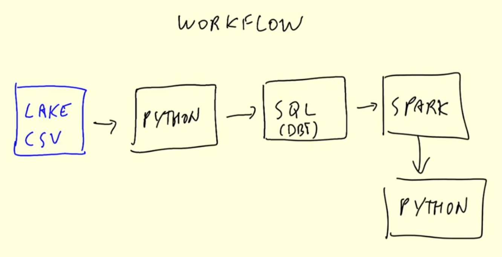

# Batch Processing

There are 2 ways of processing data:

- **Batch processing** is when the processing and analysis happens on a set of data that have already been stored over a period of time.
    - Processing *chunks* of data at *regular intervals*
    - Example: processing taxi trips each month
- **Streaming data processing** happens as the data flows through a system. This results in analysis and reporting of events as it happens.
    - Processing data on the *fly*
    - Example: processing a taxi trip as soon as it's generated

Batch jobs may be scheduled in many ways:
- Weekly
- Daily (typical)
- Hourly (typical)
- X times per hour
- Every 5 minutes

Batch jobs may be carried out using different technologies:
- Python scripts (can be run in Kubernetes, AWS Batch, etc)
- SQL
- Spark
- Flink

A workflow orchestration tool such as Airflow is used to orchestrate all the batch jobs.

Here is an example of a typical workflow for batch jobs:

**Advantage of batch processing**
- **Easy to manage**: There are multiple tools to manage the batch jobs.
- **Re-executable**: Jobs can be easily retried if they fail.
- **Scalable**: Scripts can be executed in more capable machines, Spark can be run in bigger clusters, etc.

**Disadvantages of batch processing**
- **Delay**: Each task of a workflow may take a few minutes. Assuming the whole workflow takes 20 minutes, we would need to wait those 20 minutes until the data is ready for work.

The advantages of batch jobs often compensate for its shortcomings, and as a result most companies that deal with data tend to work with batch jobs most of the time (80-90%).