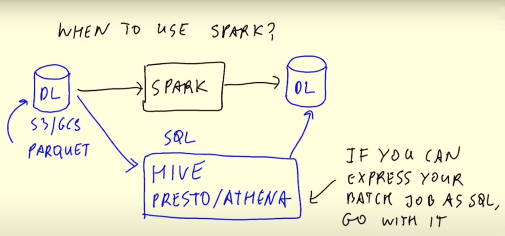
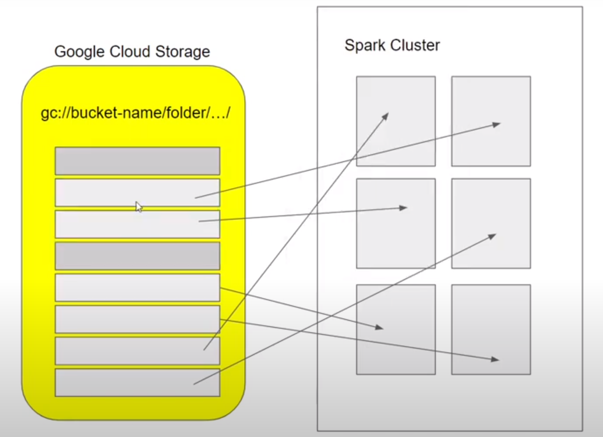
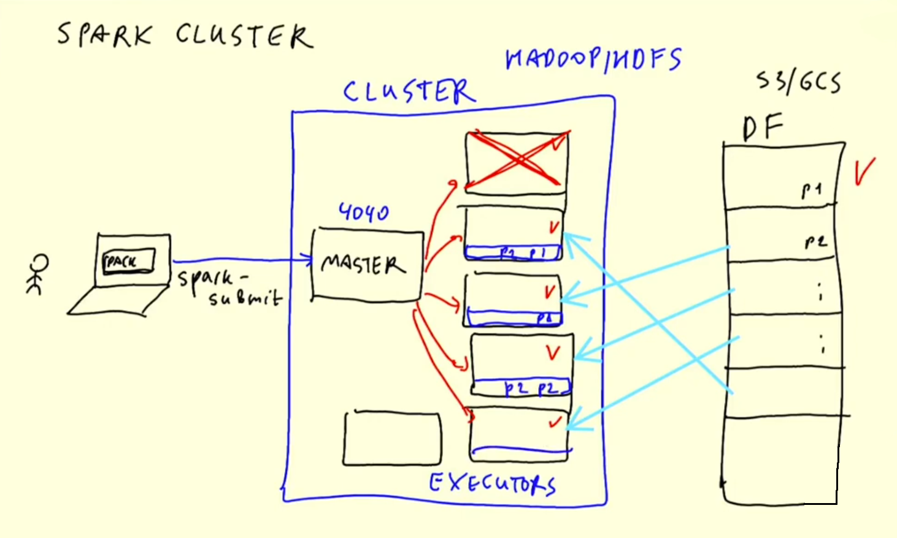
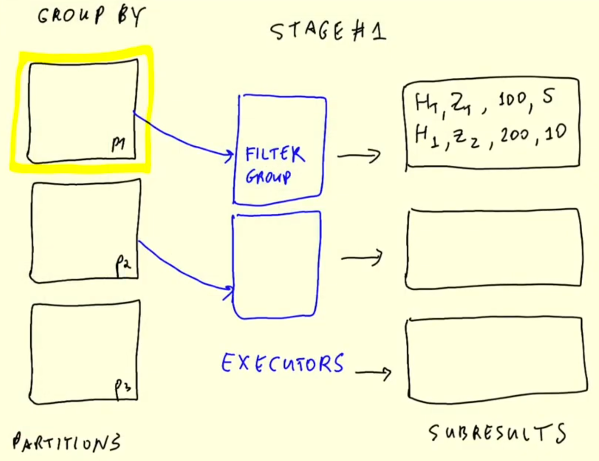
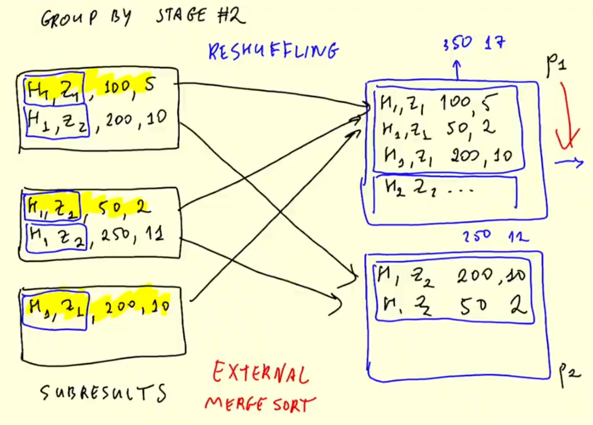
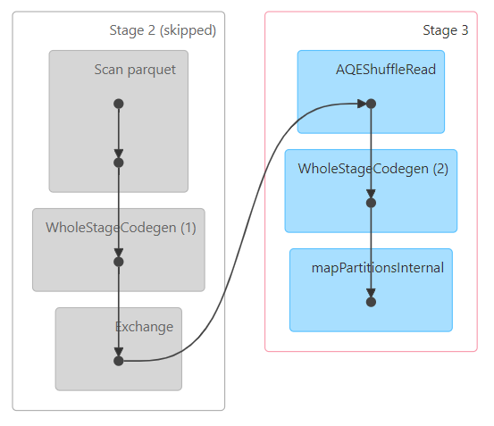
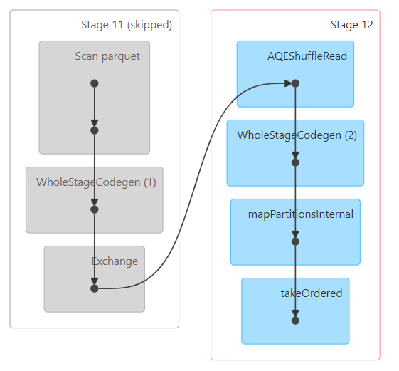

# Spark

Apache Spark is an open-source multi-language unified analytics engine for large-scale data processing.
- Spark is an engine because it processes data.
- Spark can be ran in clusters with multiple nodes, each pulling and transforming data.
- Spark is multi-language because we can use Java and Scala natively, and there are wrappers for Python, R and other languages. The wrapper for Python is called PySpark.

Spark can be used to execute both batch and streaming jobs. A streaming job is essentially a sequence of small batch jobs.

### When to use Spark?

Spark is used for processing data in a Data Lake.



There are tools such as Hive, Presto or Athena that allow us to express jobs as SQL queries. If a batch job can be expressed with SQL, then these tools should be used.

However, there are times where we need to apply more complex manipulation which are very difficult or even impossible to express with SQL. In these instances, Spark is the tool to use.

## Installation (Windows)

### Install Java

Download **Java** from: https://www.java.com/en/
- Spark runs on Java 8/7/11
- Install JRE-8 and change the destination folder to `C:\jre-8`
- Add a new **System Variable**
    - Variable name = `JAVA_HOME`
    - Variable value = `C:\jre-8`
- Check that Java works correctly by running `java -version` in the command prompt
    - We should see version `1.8.0`
- Run the command `echo %JAVA_HOME%` to see the location of Java

### Install Hadoop

- Create a folder `C:\hadoop-3.0.0\bin`
- Download `winutils.exe` and `hadoop.dll` from: https://github.com/steveloughran/winutils/blob/master/hadoop-3.0.0/bin/ and save it in the folder
- Add a new **System Variable**
    - Variable name = `HADOOP_HOME`
    - Variable value = `C:\hadoop-3.0.0`
- Edit the **User Variable** `Path`
    - Add a new value `%HADOOP_HOME%\bin`

### Install PySpark

- Run `pip install pyspark` or `pipenv install pyspark`

## Spark Basics

We will import `pyspark` in a jupyter notebook to learn how to use Spark.

### Creating a Spark session

`SparkSession` is an object that is used for interacting with Spark.

```python
spark = SparkSession.builder \
    .master("local[*]") \
    .appName('test') \
    .getOrCreate()
```
- `SparkSession` is the class of the object that we instantiate. `builder` is the builder method.
- `master()` sets the Spark master URL to connect to. The `local` string means that Spark will run on a local cluster. `[*]` means that Spark will run with as many CPU cores as possible.
- `appName()` defines the name of our application/session. This will show in the Spark UI.
- `getOrCreate()` will create the session or recover the object if it was previously created.

Once we've instantiated a session, we can access the Spark UI by navigating to `localhost:4040` in a web browser. The UI will display all current jobs. Since we've just created the instance, there should be no jobs currently running.

### Reading CSV files

Download the High Volume For-Hire Vehicle Trip Records for January 2021 dataset from here: https://github.com/DataTalksClub/nyc-tlc-data/releases/tag/fhvhv. Then, unzip the CSV file.

In GitBash run the command `wc -l fhvhv_tripdata_2021-01.csv` to check the number of rows in the file. It should be 11908469 rows.

To read the CSV file, run the following code in the jupyter notebook:

```python
df = spark.read \
    .option("header", "true") \
    .csv('fhvhv_tripdata_2021-01.csv')
```
- `read()` reads the file.
- `option()` contains options for the `read` method. In this case, we're specifying that the first line of the CSV file contains the column names.
- `csv()` is for reading CSV files.

Spark reads CSV files into dataframes.
- Unlike `pandas`, Spark can handle much bigger datasets but it's unable to infer the datatypes of each column.
- Spark dataframes use custom data types; we cannot use regular Python types.

To check the current schema of the dataframe, we can run `df.schema`. We will notice that the data type of each column is `StringType()`.

We can fix this by using pandas to get the datatypes of the dataset and using that to change the Spark schema. We only need a few rows for pandas to get the datatypes.

To create a smaller dataset run the command `head -n 1001 fhvhv_tripdata_2021-01.csv > head.csv` in GitBash.

We can create a new schema for the spark dataframe by running  `spark.createDataFrame(df_pandas).schema`.

In the example, PULocationID and DOLocationID are of `long` type. We want to use `int` instead because `long` is more inefficient in this case. `int` uses only 4 bytes whereas `long` uses 8 bytes.

We can use `StructType` to define the schema by running the following code:

```python
from pyspark.sql import types

schema = types.StructType([
    types.StructField('hvfhs_license_num', types.StringType(), True),
    types.StructField('dispatching_base_num', types.StringType(), True),
    types.StructField('pickup_datetime', types.TimestampType(), True),
    types.StructField('dropoff_datetime', types.TimestampType(), True),
    types.StructField('PULocationID', types.IntegerType(), True),
    types.StructField('DOLocationID', types.IntegerType(), True),
    types.StructField('SR_Flag', types.StringType(), True)
])

df = spark.read \
    .option("header", "true") \
    .schema(schema) \
    .csv('fhvhv_tripdata_2021-01.csv')
```
- `types` contains all of the available data types for Spark dataframes.
- `True` means the field is nullable.

### Partitioning

A **Spark cluster** is composed of multiple **executors**. Each executor can process data independently in order to parallelize and speed up work.



In the previous example we read a single large CSV file. A file can only be read by a single executor, which means that the code we've written so far isn't parallelized and thus will only be run by a single executor rather than many at the same time.

In order to solve this issue, we can split a file into multiple chunks so that each executor can process a chunk and have all executors working simultaneously. These splits are called **partitions**.

We will now read the CSV file, partition the dataframe and parquetize it. This will create multiple files in parquet format. Converting to parquet is an expensive operation which may take several minutes.

```python
# create 24 partitions in our dataframe
df = df.repartition(24)

# parquetize and write to 'fhvhv/2021/01/' folder
df.write.parquet('fhvhv/2021/01/')
```
- `repartition()` is a lazy command and does not trigger anything. The partitioning will take place only when we write the dataframe into parquet files.

We can check the Spark UI at any time and see the progress of the current job, which is divided into stages which contain tasks. The tasks in a stage will not start until all tasks on the previous stage are finished.

When creating a dataframe, Spark creates as many partitions as CPU cores available by default, and each partition creates a task. Thus, assuming that the dataframe was initially partitioned into 6 partitions, the `write.parquet()` method will have 2 stages: the first with 6 tasks and the second one with 24 tasks.

Besides the 24 parquet files, we should also see a `_SUCCESS` file which should be empty. This file is created when the job finishes successfully.

Trying to write the files again will output an error because Spark will not write to a non-empty folder. We can force an overwrite with the `mode` argument: `df.write.parquet('fhvhv/2021/01/', mode='overwrite')`

We can read the parquet files by running `df = spark.read.parquet('fhvhv/2021/01/')`. Parquet remembers the data types specified in the schema. We can also run `df.printSchema()` to check the schema.

One of the reasons why parquet files are smaller than CSV files is because they store the data according to the datatypes, so `int` values take less space than `long` or `string` values.

## Spark DataFrames

### DataFrame operations

There are many Pandas-like operations that we can do on Spark dataframes, such as:
- **Column selection**: returns a dataframe with only the specified columns.
    ```python
    new_df = df.select('pickup_datetime', 'dropoff_datetime', 'PULocationID', 'DOLocationID')
    ```
- **Filtering by value**: returns a dataframe whose records match the condition stated in the filter.
    ```python
    new_df = df.select('pickup_datetime', 'dropoff_datetime', 'PULocationID', 'DOLocationID').filter(df.hvfhs_license_num == 'HV0003')
    ```
    - This does not execute unless we also append `.show()` at the end of the code. We should be able to see a new job in the Spark UI.

### Actions vs Transformations

- **Transofrmations**: These are lazy commands. They are not executed right away.
    - `select()`
    - `filter()`
    - `join()`
    - `groupBy()`
    - `repartition()`
    - etc.
- **Actions**: These are eager commands. They are executed immediately. Computations only happen when actions are triggered.
    - `show()`
    - `take()`
    - `head()`
    - `read()`
    - `write()`
    - etc.

```python
df.select('pickup_datetime', 'dropoff_datetime', 'PULocationID', 'DOLocationID') \
  .filter(df.hvfhs_license_num == 'HV0003') \
  .show()
```
- In this example, the whole instruction gets evaluated only when the `show()` action is triggered.

### Functions and User Defined Functions (UDFs)

Spark provides built-in functions that allow for more complex data manipulation.

Here's an example of built-in function usage:
```python
from pyspark.sql import functions as F

df \
    .withColumn('pickup_date', F.to_date(df.pickup_datetime)) \
    .withColumn('dropoff_date', F.to_date(df.dropoff_datetime)) \
    .select('pickup_date', 'dropoff_date', 'PULocationID', 'DOLocationID') \
    .show()
```
- `withColumn()`: adds a new column to the dataframe. Adding a new column with the same name as a previously existing column will overwrite the existing column!
- `select()`: selects the stated columns.
- `F.to_date()`: built-in Spark function that converts a timestamp to date format (year, month and day only, no hour and minute).

Besides these built-in functions, Spark also allows us to create **User Defined Functions** (UDFs) with custom behavior for those instances where creating SQL queries for that behaviour becomes difficult both to manage and test.

UDFs are regular python functions which are then passed as parameters to a special builder.

```python
# create a function
def crazy_stuff(base_num):
    num = int(base_num[1:])
    if num % 7 == 0:
        return f's/{num:03x}'
    elif num % 3 == 0:
        return f'a/{num:03x}'
    else:
        return f'e/{num:03x}'

# convert the function to a user-defined function
crazy_stuff_udf = F.udf(crazy_stuff, returnType=types.StringType())
```
- `F.udf()` can be used to convert a function into a user-defined function. In this example, `crazy_stuff()` is the function and the return type for the function is string.

We can then use the UDF in transformations just like built-in functions:

```python
df \
    .withColumn('pickup_date', F.to_date(df.pickup_datetime)) \
    .withColumn('dropoff_date', F.to_date(df.dropoff_datetime)) \
    .withColumn('base_id', crazy_stuff_udf(df.dispatching_base_num)) \
    .select('base_id', 'pickup_date', 'dropoff_date', 'PULocationID', 'DOLocationID') \
    .show()
```

## Spark SQL

Spark can also run SQL queries.

### Combining two datasets

Load the parquet files for yellow and green taxi data for 2020 and 2021 to Spark dataframes by running the following code:

```python
df_green = spark.read.parquet('data/pq/green/*/*')
df_yellow = spark.read.parquet('data/pq/yellow/*/*')
```
Create two new columns called `pickup_datetime` and `dropoff_datetime` in the two dataframes because the column names are different in each dataframe:

```python
df_green = df_green \
    .withColumnRenamed('lpep_pickup_datetime', 'pickup_datetime') \
    .withColumnRenamed('lpep_dropoff_datetime', 'dropoff_datetime')

df_yellow = df_yellow \
    .withColumnRenamed('tpep_pickup_datetime', 'pickup_datetime') \
    .withColumnRenamed('tpep_dropoff_datetime', 'dropoff_datetime')
```
- `withColumnRenamed(arg1, arg2)` is used to create a new column where `arg1` is the name of the new column and `arg2` is the calculation for the content of the new column.

Create a combined dataframe with the common columns to both datasets:

```python
# find common columns in both dataframes
common_colums = []
yellow_columns = set(df_yellow.columns)
for col in df_green.columns:
    if col in yellow_columns:
        common_colums.append(col)

# select common columns from both dataframes and create a new column called `service_type`
df_green_sel = df_green \
    .select(common_colums) \
    .withColumn('service_type', F.lit('green'))

df_yellow_sel = df_yellow \
    .select(common_colums) \
    .withColumn('service_type', F.lit('yellow'))

# combine both the dataframes into one dataframe
df_trips_data = df_green_sel.unionAll(df_yellow_sel)
```
- `F.lit()` adds a literal or constant to a dataframe. We use it here to fill the `service_type` column with a constant value, which is its corresponding taxi type.

Now we can count the amount of records per taxi type by running the following code:

```python
df_trips_data.groupBy('service_type').count().show()
```

### Querying a dataset with Temporary Tables

SQL expects a table for retrieving records, but a dataframe is not a table. We need to register a dataframe as a table first by running the following code:

```python
df_trips_data.registerTempTable('trips_data')
```
- This method creates a temporary table with the name `trips_data`.

We can now perform regular SQL operations:

```python
spark.sql("""
SELECT
    service_type,
    count(1)
FROM
    trips_data
GROUP BY 
    service_type
""").show()
```
- This query outputs the same result as `df_trips_data.groupBy('service_type').count().show()`
- The query output can be manipulated as a dataframe, which means that we can perform any queries on our table and manipulate the results with Python as we see fit.

We can also write more complex queries as the following:

```python
df_result = spark.sql("""
SELECT 
    -- Reveneue grouping 
    PULocationID AS revenue_zone,
    date_trunc('month', pickup_datetime) AS revenue_month, 
    service_type, 

    -- Revenue calculation 
    SUM(fare_amount) AS revenue_monthly_fare,
    SUM(extra) AS revenue_monthly_extra,
    SUM(mta_tax) AS revenue_monthly_mta_tax,
    SUM(tip_amount) AS revenue_monthly_tip_amount,
    SUM(tolls_amount) AS revenue_monthly_tolls_amount,
    SUM(improvement_surcharge) AS revenue_monthly_improvement_surcharge,
    SUM(total_amount) AS revenue_monthly_total_amount,
    SUM(congestion_surcharge) AS revenue_monthly_congestion_surcharge,

    -- Additional calculations
    AVG(passenger_count) AS avg_montly_passenger_count,
    AVG(trip_distance) AS avg_montly_trip_distance
FROM
    trips_data
GROUP BY
    1, 2, 3
""")
```
- SQL queries are transformations, so we need an action to perform them such as `df_result.show()`.

We can also store the results as a parquet file just like any other dataframe by running the following code:

```python
df_result.write.parquet('data/report/revenue/')
```
- This will create more than 200 parquet files of very small size, which isn't very desirable.
- In order to reduce the amount of files, we need to reduce the amount of partitions of the dataset. This can be done with the `coalesce()` method:

```python
df_result.coalesce(1).write.parquet('data/report/revenue/', mode='overwrite')
```
- This reduces the number of partitions to just 1.

## Spark Internals

### Anatomy of a Spark Cluster

Until now we have only used a local cluster (`LOCAL[*]`) to run Spark.

Spark clusters often contain multiple computers that behave as **executors**. Spark clusters are managed by a **master**. A **driver** sends a Spark job to the master. A driver can be an Airflow job, a computer running a local script, etc. The master divides the work among the executors. If any executor fails and becomes offline, the master reassigns the task to another executor.

Each executor fetches a **dataframe partition** stored in a data lake (S3, GCS), processes the data, and then store it back in the data lake or somewhere else. If there are more partitions than executors, executors keep fetching partitions until every single one has been processed.



This is in contrast to [Hadoop](https://hadoop.apache.org/), another data analytics engine, whose executors locally store the data they process. Partitions in Hadoop are duplicated across several executors for redundancy and in case an executor fails. Hadoop is meant for clusters made of commodity hardware computers. However, data locality has become less important as storage and data transfer costs have dramatically decreased. Thus nowadays it's feasible to separate storage from computation and Hadoop has become less popular.

### GroupBy in Spark

The following query calculates the total revenue and amount of trips per hour per zone. This is done by performing a `GROUP BY hour, zone`.

```python
# load green taxi trip data parquet files
df_green = spark.read.parquet('data/pq/green/*/*')

# register green taxi trip dataframe as a table
df_green.registerTempTable('green')

# execute a group by
df_green_revenue = spark.sql("""
SELECT 
    date_trunc('hour', lpep_pickup_datetime) AS hour, 
    PULocationID AS zone,

    SUM(total_amount) AS amount,
    COUNT(1) AS number_records
FROM
    green
WHERE
    lpep_pickup_datetime >= '2020-01-01 00:00:00'
GROUP BY
    1, 2
""")

# display the query results
df_green_revenue.show()
```

Since the data is split along partitions, it's likely that Spark will need to group data which are in separate partitions. We know from the previous section that executors only deal with individual partitions. Spark solves this issue by separating the grouping in 2 stages.

In the first stage, each executor groups the results in the partition they're working on and outputs the results to a temporary partition. These temporary partitions are the **intermediate results**.



In the second stage, the data goes through **reshuffling**. Spark puts all records with the same **keys** into the same partition. In this example, the keys are `hour` and `zone`. The algorithm to do this is called **external merge sort**. Once reshuffling is completed, Spark applies `GROUP BY` to the new partitions and **reduces** the records to the final output. The reshuffled partitions may contain more than one key, but all records belonging to a key should end up in the same partition.



Running the code should display the following DAG in the Spark UI:


- The `Exchange` task refers to the reshuffling.

If we were to add sorting to the query by adding `ORDER BY 1,2` at the end, Spark would perform a very similar operation to `GROUP BY` after grouping the data. The resulting DAG would look liked this in the Spark UI:



By default, Spark repartitions the dataframe into 200 partitions after reshuffling the data. This is fine for large datasets, but this could be counterproductive in small datasets (our example) because of the small size of each partition/file.

Repartitioning also involves reshuffling data.

Reshuffling is an **expensive operation**, so it is in our best interest to reduce the amount of data to shuffle when querying.

