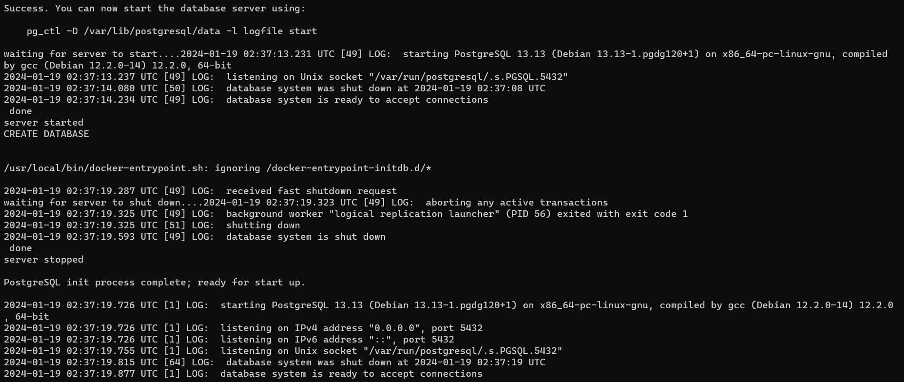
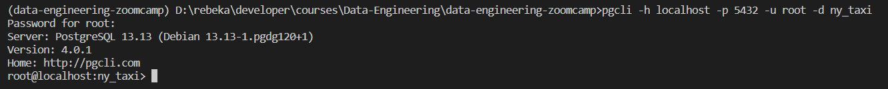
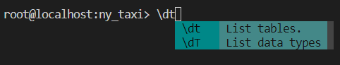
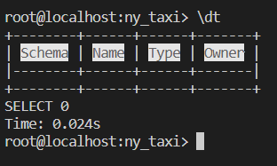

# Ingesting NY Taxi Data into Postgres

## Setting up Postgres in Docker

To run Postgres we need to use the official Docker image of Postgres.

**Docker compose** is a way to run multiple docker images. It is a `YAML` file.

> docker-compose.yaml
```yaml
services:
	postgres:
		image: postgres:13
		environment:
			POSTGRES_USER: airflow
			POSTGRES_PASSWORD: airflow
			POSTGRES_DB: airflow
		volumes:
			- postgres-db-volume:/var/lib/postgresql/data
		healthcheck:
			test: ["CMD", "pg_isready", "-U", "airflow"]
			interval: 5s
			retries: 5
		restart: always
```
- `image: postgres:13` is the image name:version
- `environment:` contains the environment variable to configure postgres (user, password, database name)
- `volumes` is used to map a folder in host machine file system to a folder in the container. This allows postgres to store its files in the file system. Postgres refers to this path inside the container to read and write data. Docker doesn't maintain "state", so when we restart docker the data is lost. Keeping the data in a path means that it doesn't go away when we restart data. This is also called mounting.

First, create a folder called **ny_taxi_postgres_data** which will be the "volume" to keep our persistent data.

To check what docker instances are running right now, run `docker ps`.

Then, run the following command in the command line:

> Windows
```bash
docker run -it \
	-e POSTGRES_USER="root" \
	-e POSTGRES_PASSWORD="root" \
	-e POSTGRES_DB="ny_taxi" \
	-v D:/rebeka/developer/courses/Data-Engineering/data-engineering-zoomcamp/1_containerization/1_docker/ny_taxi_postgres_data:/var/lib/postgresql/data \
	-p 5432:5432 \
	postgres:13
```
> Linux
```bash
docker run -it \
	-e POSTGRES_USER="root" \
	-e POSTGRES_PASSWORD="root" \
	-e POSTGRES_DB="ny_taxi" \
	-v $(pwd)/ny_taxi_postgres_data:/var/lib/postgresql/data \
	-p 5432:5432 \
	postgres:13
```
- `e` declares the environment variables
- `v` declares volume path
- `p` declares you local host network port from where we can access the database (`localhost:5432`)


My machine did not like the back slash separated multiline command so I ran this instead:

`docker run -it -e POSTGRES_USER="root" -e POSTGRES_PASSWORD="root" -e POSTGRES_DB="ny_taxi" -v D:/rebeka/developer/courses/Data-Engineering/data-engineering-zoomcamp/1_containerization/1_docker/ny_taxi_postgres_data:/var/lib/postgresql/data -p 5432:5432 postgres:13`



Once it says `database system is ready to accept connections`, if we check inside the **ny_taxi_postgres_data** folder we will see some files. This is a representation of data for postgres.

## Accessing the database inside the container

We will use `pgcli` to access the database. `pgcli` stands for Postgres CLI. It enables us to interact with a Potsgresql database from the terminal and through Python script.

To install the library `pgcli` python library, run `pip install pgcli` from another terminal. Since I'm using a virtual environment for this project, I ran `pipenv install pgcli`.

Next, run the following command by referencing the image container config `pgcli -h localhost -p 5432 -u root -d ny_taxi`

- `h` is the host variable
- `p` is the port
- `u` is the username
- `d` is the database name

On running this command there will be a prompt for the password. The password is "root" according to the image config.



We are now connected to postgres and we can run queries in the pgcli interactive shell.

## Using `pgcli`

To see a list of tables available in the database run `\dt`. This will return empty since our database is not populated.





We can run a SQL statement like `SELECT CURRENT_DATE`. This will give a response and ensure that we have a connection to the database and it is working.

## Loading the dataset into Postgres

See [upload-data.ipynb](../1_containerization/1_docker/upload-data.ipynb)