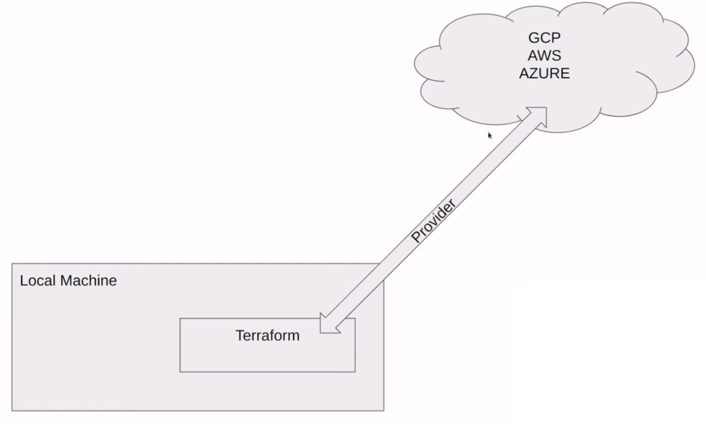
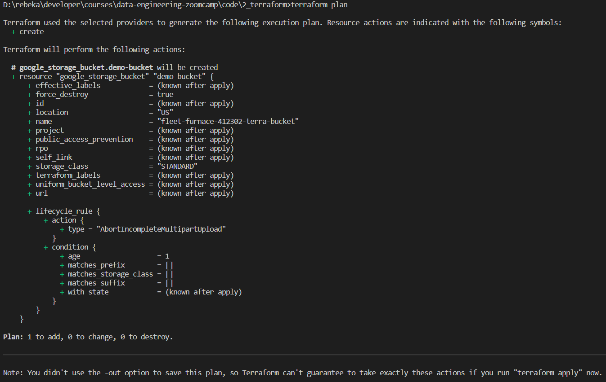
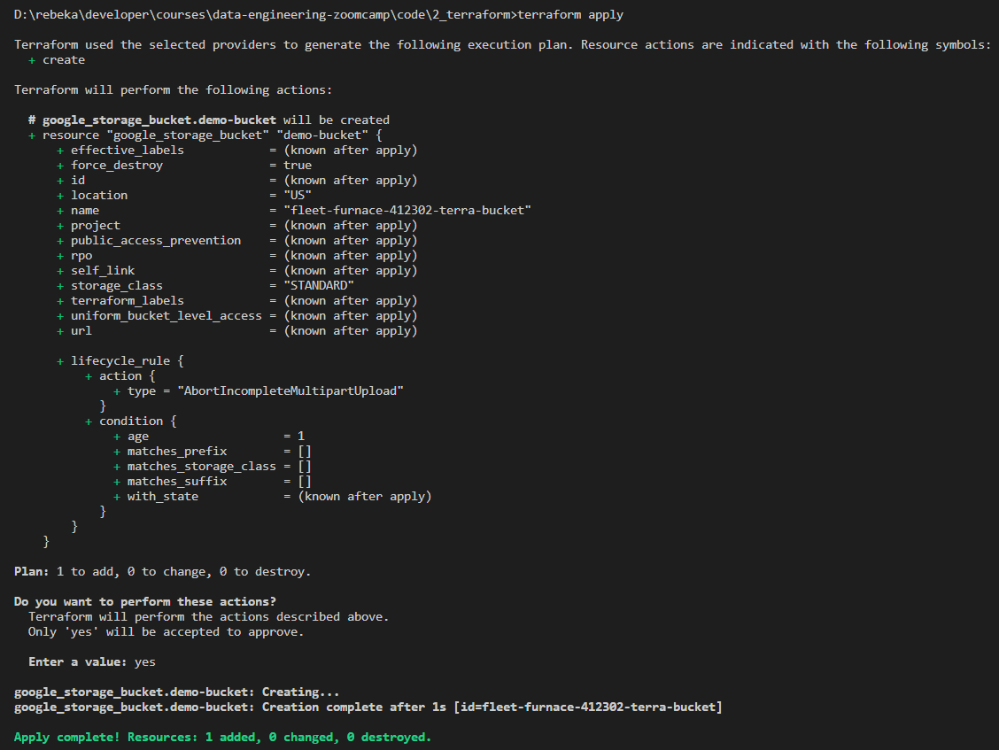
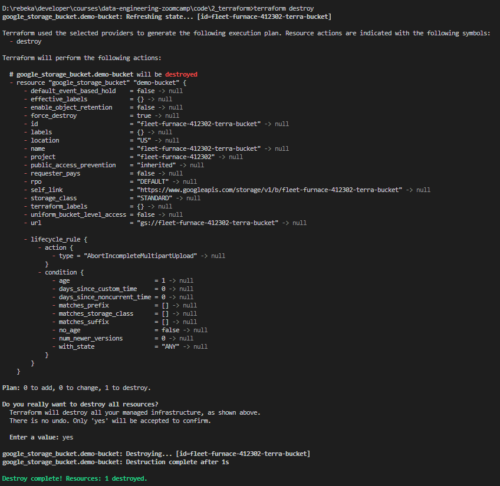

# Terraform

[**HashiCorp Terraform**](https://developer.hashicorp.com/terraform/intro) is an infrastructure as code tool that lets you define both cloud and on-prem resources in human-readable configuration files that you can version, reuse, and share. You can then use a consistent workflow to provision and manage all of your infrastructure throughout its lifecycle. Terraform can manage low-level components like compute, storage, and networking resources, as well as high-level components like DNS entries and SaaS features.

### Why use Terraform?

- Simplicity in keeping track of infrastructure
- Easier collaboration
- Reproducibility
- Ensure resources are removed

### What Terraform is not

- Does not manage and update code on infrastructure
- Does not give you the ability to change immutable resources
- Not used to manage resources not defined in your terraform files

### What Terraform is

- Infrastructure as code

### How Terraform works

We need to have Terraform downloaded and running on our local machine. A provider allows us to communicate with different services that allow us to bring up infrastructure. For example, if we want to use the AWS provider, we will need to define that in the Terraform files. Terraform will use that provider to connect with AWS. We will need to authorize the access (via service account, access token, etc.)



Provider is code that allows Terraform to communicate to manage resources on
- AWS
- Azure
- GCP
- Kubernetes
- VSphere
- Alibaba Cloud
- Oracle Cloud Infrastructure
- Active Directory
- [See more](https://registry.terraform.io/browse/providers)

## Key Terraform Commands

- `terraform init` - Once we have defined the provider when we run this command it is going to go out and get that code and bring it to our local machine
- `terraform plan` - Once we have defined some resources we can run this command to see the resources that will be created
- `terraform apply` - We can run this command to build the infrastructure based on what is defined in the `.tf` files
- `terraform destroy` - we can run this command to remove everything defined in the `.tf` files

## Simple one file Terraform Deployment

### Setup Google Cloud Platform (GCP)

Cloud provider account: https://console.cloud.google.com/

We will be using GCP for our Cloud platform in this course. GCP provides $300 in free credits for new customers for 90 days. After that, there is no charge to use free tier products up to their specified [free usage limit](https://cloud.google.com/free/docs/free-cloud-features?_gl=1*1pzeae3*_up*MQ..&gclid=Cj0KCQiAh8OtBhCQARIsAIkWb6_sLf2va2PbyIRFOoypMawQ8yaxyBvU1o5YUWu-2dE8r70waoFh_zAaAo2QEALw_wcB&gclsrc=aw.ds).

### Create a service account in GCP

We need to setup a way for Terraform on our local machine to be able to tell GCP that we are who we say we are and that we have access to create resources. In order to do that we need to create a **service account**. A service account similar to a regular user account except that it is not meant to be logged-in to. It is used by software to run tasks and programs.

To setup a Service Account, navigate to **IAM & Admin** > **Service Accounts** from the left hamburger menu. Then click on the **CREATE SERVICE ACCOUNT** button at the top of the screen. Create a service account called `terraform-runner`. Then add the following roles to grant this service account access to project and then click **Done**:
- **Cloud Storage** > **Storage Admin**
- **BigQuery** > **BigQuery Admin**
- **Compute Engine** > **Compute Admin**

In the real world we would want to limit these access. These are broad rolls that give us all kinds of access to put objects into the bucket, retrieve objects from it, delete objects in the bucket. With terraform we will only be setting up and taking down resources, so for cloud storage we would only need the ability to create and destroy buckets. For BigQuery we would only want to be able to create a dataset and then destroy it.

If you are working on a project and you didn't need to be able to create and destroy a certain resources when you started out but need that access now, instead of destroying the service account and creating a new service account with those permissions, you can navigate to **IAM**, click on **Edit principal** next to the service account, and add another role.

Now we have a service account, but we need a way to say that we indeed have permissions to run as that service account. Navigate to **Service Accounts**, click on the ellipse next to the service account, and select **Manage keys**. Click on **ADD KEY** > **Create new key** > select **JSON** key type > **CREATE**. A key will be downloaded to our machine.

It is important to note here that service account keys could pose a security risk if compromised. If someone gets access to this service account they can create VM instances that cost thousands of dollars an hour and mine Bitcoin. The can make command and control servers for botnets.

Save the key in the project directory under a sub-directory called **keys** and in a file called **creds.json**. Add the subfolder **keys** to **.gitignore**.

### Get the Terraform provider for GCP

Terraform client installation: https://www.terraform.io/downloads
1. Download Terraform.
2. From the download, extract the executable to a directory of your choosing (for example, c:\terraform).
3. Update your system's global path to the executable.
4. Open a terminal window.
5. Verify the global path configuration with the terraform command `terraform -version`

Install the **HashiCorp Terraform** extension in VSCode.

Create a **main.tf** Terraform file in the project directory. Use the documentation for [Terraform GCP Provider](https://registry.terraform.io/providers/hashicorp/google/latest/docs) to get the code to create the configuration.

>main.tf
```terraform
terraform {
  required_providers {
    google = {
      source  = "hashicorp/google"
      version = "5.13.0"
    }
  }
}

provider "google" {
  # Configuration options
  credentials = "./keys/creds.json"
  project     = "fleet-furnace-412302"
  region      = "us-west3"
}
```

- Get the `project` id by clicking on the hamburger menu > **Cloud overview** > **Dashboard** > grab the Project ID.
- Set the `region` somewhere close to home (`us-west3`).
- Set the `credentials` to the path for the **creds.json** file that we saved earlier.
- If we have the Google Cloud SDK installed we could use it to authorize the credentials instead of hard coding the path to the credentials JSON file.
- We can use the command `terraform fmt` to format a Terraform file.

Next, run `terraform init` in the command line to get the provider, which is the piece of code that terraform is going to use to talk to GCP. (Think of provider as the door and the credentials file is the key that lets us open the door.)


The provider code is now downloaded into the project directory under **.terraform**. It is not human readible code.

The **.terraform.lock.hcl** file contains hashes of the provider to ensure that we have the correct version.

### Create a Bucket in GCP using Terraform

In the GCP console, navigate to the hamburger menu on the left side > **Cloud Storage** > **Buckets**. We will notice that there are no buckets.

Append the code for creating [google storage bucket](https://registry.terraform.io/providers/hashicorp/google/latest/docs/resources/storage_bucket) into **main.tf**:

```terraform
resource "google_storage_bucket" "demo_bucket" {
  name          = "fleet-furnace-412302-terra-bucket"
  location      = "US"
  force_destroy = true

  lifecycle_rule {
    condition {
      age = 1
    }
    action {
      type = "AbortIncompleteMultipartUpload"
    }
  }
}
```
- We are definining a resource. `google_storage_bucket` is the type of resource we want to create.
- `demo-bucket` is a local variable name. If we have several buckets and want to perform some action on them in a different block, we could access that using `google_storage_bucket.demo-bucket`. It does not need to be globally unique, but `name` has to be globally unique across all of GCP. (The project name is globally unique so we can use that as a suffix to create the `name`.)
- If we are uploading files to a GCP bucket and it is a very large file, we can do a multipart parallel upload where it will bust the file into multiple chunks and processes can upload it to make it quite a bit faster. Unfortunately, sometimes it shuts down/ is incomplete and we end up having unusable data in the bucket. So  `AbortIncompleteMultipartUpload` is something good for us to have. The `lifecycle_rule` says that if it hasn't finished in one day, go ahead and clean that up.

Next, run `terraform plan` in the command line. `terraform plan` is not going to create any resources, but is a safe way to know what is going to happen.



To deploy the plan, run `terraform apply` in the command line. When it asks to **"Enter a value:"** to continue, enter **yes**.



A file called **terraform.tfstate** is created. The information in it is what we saw when we ran `terraform plan`.

Now if we refresh the **Buckets** page in the GCP console, we will see a bucket called `fleet-furnace-412302-terra-bucket`.

### Delete a bucket in GCP using Terraform

To delete the resource, run `terraform destroy` in the command line. This is going to look at **terraform.tfstate** and decide what changes it needs to make to get rid of these resources.



Now if we refresh the **Buckets** page in the GCP console, we will not see any buckets.

Since resources are not deployed, there is nothing much in the **terraform.tfstate** file as well. A file called **terraform.tfstate.backup** is created with the configuration history.

### Create a Google BigQuery Dataset using Terraform

Append the code for creating [google bigquery dataset](https://registry.terraform.io/providers/hashicorp/google/latest/docs/resources/bigquery_dataset) into **main.tf**:

```terraform
resource "google_bigquery_dataset" "demo_dataset" {
  dataset_id = "demo_dataset"
}
```

A great practice when trying to use examples from Terraform documentation is to search for fields that are `(Required)`. If you are still missing a field that is required, its not a big deal since it will still give you an error.

Now, if we run `terraform apply` in the command line, it will create both - the **google_storage_bucket** and the **google_bigquery_dataset**.

In the GCP console, we can navigate to **Cloud Storage** to see the bucket created (`fleet-furnace-412302-terra-bucket`), and to **BigQuery** to see the dataset created (`demo_dataset`).

Run the command `terraform destroy` in the command line to delete the resources.

## Deployment with a Variables File

Depending on what we are trying to do, using variables can be very handy. By convention, we define variables in a **variables.tf** file and then use those variables in the other files.

Create a file called **variables.tf**.

>variables.tf
```terraform
variable "credentials" {
  description = "My Credentials"
  default     = "./keys/creds.json"
}

variable "project" {
  description = "Project"
  default     = "fleet-furnace-412302"
}

variable "region" {
  description = "Region"
  default     = "us-west3"
}

variable "location" {
  description = "Project Location"
  default     = "US"
}

variable "bq_dataset_name" {
  description = "My BigQuery Dataset Name"
  default     = "demo_dataset"
}

variable "gcs_bucket_name" {
  description = "My Storage Bucket Name"
  default     = "fleet-furnace-412302-terra-bucket" # must be unique
}

variable "gcs_storage_class" {
  description = "Bucket Storage Class"
  default     = "STANDARD"
}
```

Now we can update the values of the resource arguments in **main.tf** with `var.[variable_name]`.

>main.tf
```terraform
terraform {
  required_providers {
    google = {
      source  = "hashicorp/google"
      version = "5.13.0"
    }
  }
}

provider "google" {
  # Configuration options
  credentials = var.credentials
  project     = var.project
  region      = var.region
}

resource "google_storage_bucket" "demo_bucket" {
  name          = var.gcs_bucket_name
  location      = var.location
  force_destroy = true

  lifecycle_rule {
    condition {
      age = 1
    }
    action {
      type = "AbortIncompleteMultipartUpload"
    }
  }
}

resource "google_bigquery_dataset" "demo_dataset" {
  dataset_id = var.bq_dataset_name
  location   = var.location
}
```

Run `terraform plan` to see if it throws any errors. Then, run `terraform apply` to create the resources. Check **Cloud Storage** and **BigQuery** in the GCP console to see if the resources were created. Then destroy the resources by running `terraform destroy`.