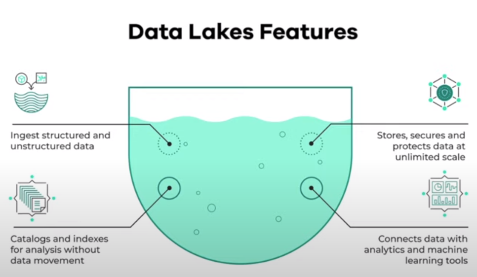

# Data Lake

A **data lake** is a central repository that holds big data from many sources. The data can be structured, semi-structured or unstructured. The idea is to ingest data as quickly as possible and make it available to stakeholders.

A data lake solution needs to be secure, scalable, and inexpensive. Data stored in data lake has associated metadata for faster access.

## Data lake vs Data Warehouse

| | Data Lake | Data Warehouse |
|---|---|---|
| Data Type | Unstructured | Structured |
| Processing | Raw and minimally processed | Cleaned, pre-processed and refined |
| Quantity | Petabytes | Terabytes |
| Application | Wide variety of data | Historic and relational data such as transactions, operations, etc |
| Use Cases | Stream processing, Machine learning, Real time analysis | Batch processing, BI reporting |
| Users | Data scientists, Data analysts | Business analysts |
| Solution | ELT (Export Load Transform) - schema on read | ETL (Export Transform Load) - schema on write |

## Limitations of Data lake

Data lakes usually starts with good intentions but soon converts into Data swamp
- Not versioning data
- Incompatible schemas for the same data without versioning
- Not assosciating metadata
- If joins are not possible

## Cloud providers for Data lake

- GCP: **Cloud Storage**
- AWS: **S3**
- Azure: **Azure Blob Storage**