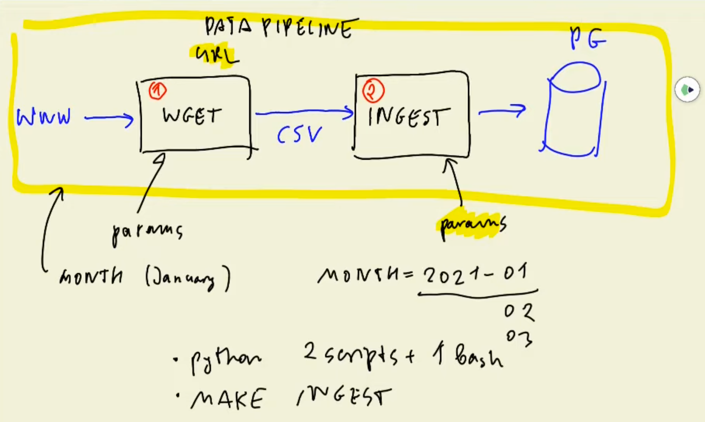
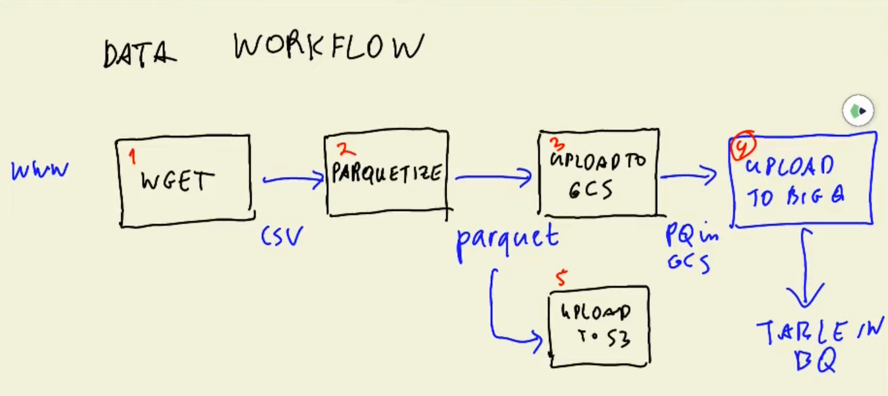

# Workflow Orchestration

The data pipeline we created in module 1 (`ingest_data.py`) isn't the best data pipeline since it combine both read and write into one script. If one aspect fails the entire pipeline fails. 

It is better to split the entire process into multiple scripts with proper checks to confirm that the previous section was executed. Sequential running, execution of multiple scripts and processes, try and except clauses and other things should be considered for a data pipeline.

This can be implemented in either of the following ways:
- We can write everything in python (2 python scripts + 1 bash script.) This is not super convenient because we have to consider when to retry, when to fail the entire pipeline, specify the order of execution, etc.
- `MAKE` is a utility that allows us to specify dependencies. If we say that `INGEST` is dependent on `WGET`, `MAKE` arranges things in such an order that makes sure that `WGET` is executed before `INGEST`.

## Data Workflow

A **Data Workflow** specifies how the data flows, the dependencies, and the jobs. Essentially it is just a slightly more complex Data Pipeline.

- **Parquet** is a more effective way of storing data on the disk. **Parquetize** is the process to convert a CSV file into a Parquet file.
- GCS = Google Cloud Storage
- BQ = BigQuery

Data Workflow is also referred to as **DAG (Directed Acyclic Graph)**. The Data Workflow can be seen as a graph where each node is a job and the edges between the nodes are the dependencies.
- Directed: Illustrates the direction of workflow
- Acyclic: There are no cycles or loops
- Graph: The visual representation of the workflow

## Workflow Orchestration

Workflow Engines are tools that let us define DAGs and parametrize the graph. They have retry mechanisms, history and logs, and they ensure the sequential execution of jobs.

Workflow Orchestration Tools:
- Luigi
- Apache Airflow
- Prefect
- Argo
- **Mage**

A large part of data engineering is **extracting**, **transforming**, and **loading** data between sources. 

Orchestration is a process of dependency management, facilitated through **automation**.

The data orchestrator manages scheduling, triggering, monitoring and even resource allocation.

Every workflow requires sequential steps.
- Steps = tasks
- Workflows = DAGs/ pipeline

Orchestration is an undercurrent because it happens throughout the entire process; it is key to the entire process.

A good orchestrator handles:
- Workflow management
- Automation
- Error handling
- Recovery
- Monitoring and alerting
- Resource optimization
- Observability
- Debugging
- Compliance and auditing

A good orchestrator prioritizes developer experience.