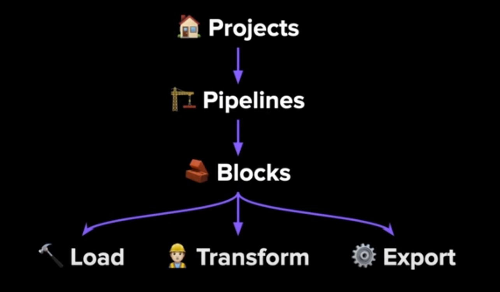
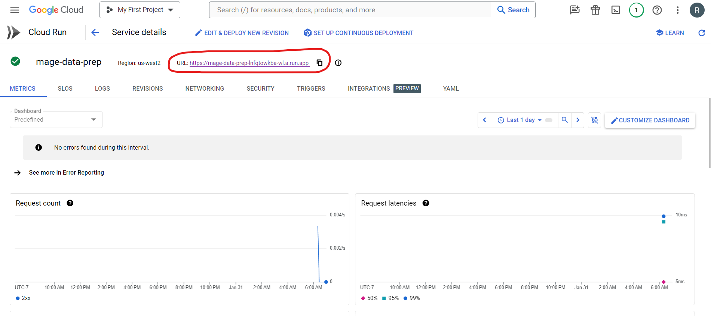

# Introduction to Mage

**Mage** is an open-source pipeline tool for orchestrating, transforming, and integrating data.

### Why Mage?
- Hybrid environment
    - Use the Mage GUI or any IDE of choice (VSCode)
    - Use **blocks** as testable, reusable pieces of code
- Improved developer experience
    - Code and test in parallel
    - Reduce dependencies, switch tools less, be efficient
- Built-in engineering best practices
    - In-line testing and debugging (notebook style)
    - Fully features observability (transformation in one place; integration with dbt)
    - DRY principles (Don't Repeat Yourself; no more DAGs with duplicate functions and weird imports)
- **Reduce time in undifferentiated work**

### Mage Concepts



- **Projects**: A project forms the basis of all the work we can do in Mage. It contains the code for all the pipelines, blocks, and other assets. A Mage instance has one or more projects.
- **Pipelines**: A pipeline is a workflow that executes some data operation - extracting, transforming, and loading data from an API. They are called DAGs on other platforms. In Mage, pipelines can contain blocks and charts. Each pipeline is represented by a `YAML` file in the **pipelines** folder of the project.
- **Blocks**: A block is a file (Python, SQL or R) that can be executed independently or within a pipeline. Together, blocks form DAGs and are used to **extract**, **transform** or **load** data. A block won't start running in a pipeline intill all its upstream dependencies are met.
    - **Sensors**: can trigger an event
    - **Conditionals**: have branching/ if-else logic 
    - **Dynamics**: can create dynamic children
    - Webhooks
    - Data integration
    - Unified pipelines
    - Multi-user envs
    - Templating

### Anatomy of a Block

- Imports
- Decorator
- Function
- Assertion (test)

## Configure Mage

Start by cloning the [mage-zoomcamp](https://github.com/mage-ai/mage-zoomcamp) repo by running the following command: `git clone https://github.com/mage-ai/mage-zoomcamp.git mage-zoomcamp`

- I copied the contents of the repo to a folder called `4_mage`.
- Rename `dev.env` to simply `.env`. This will ensure the file is not committed to Git by accident, since it will contain credentials in the future.

To build the Docker container, run `docker compose build`.

Updates are pushed regularly to Mage. In the future, if we are behind a version and need to update Mage, we can do that by running `docker pull mageai/mageai:latest`. This will pull the latest image from the Mage repo. This requires a lot of data and may take a few minutes.

To start the Docker container, run `docker compose up`.

Then, navigate to http://localhost:6789 in the browser.

We just initialized a new mage repository. It will be present in the project under the name `magic-zoomcamp`. To change the project name we need to change the `PROJECT_NAME` variable  in the `.env` file

This repository should have the following structure:

```
.
├── mage_data
│   └── magic-zoomcamp
├── magic-zoomcamp
│   ├── __pycache__
│   ├── charts
│   ├── custom
│   ├── data_exporters
│   ├── data_loaders
│   ├── dbt
│   ├── extensions
│   ├── interactions
│   ├── pipelines
│   ├── scratchpads
│   ├── transformers
│   ├── utils
│   ├── __init__.py
│   ├── io_config.yaml
│   ├── metadata.yaml
│   └── requirements.txt
├── Dockerfile
├── README.md
├── dev.env
├── docker-compose.yml
└── requirements.txt
```

## ETL: API to Postgres

### Configuring Postgres

In the Mage GUI, navigate to `magic-zoomcamp` > **Files** > **io_config.yaml**. (This can also be done in VSCode.)

Create a connection profile called `dev` and add postgres configuration by adding this following code to the end of the file:

```docker
dev:
  POSTGRES_CONNECT_TIMEOUT: 10
  POSTGRES_DBNAME: postgres
  POSTGRES_SCHEMA: public # Optional
  POSTGRES_USER: username
  POSTGRES_PASSWORD: password
  POSTGRES_HOST: hostname
  POSTGRES_PORT: 5432
```

We need to pull in the environment variables because that is what is being passed in Docker. The way to interpolate environment variables in Mage is through Jinja templating. This is done with two brackets and using the `env_var()` syntax.

```docker
dev:
  POSTGRES_CONNECT_TIMEOUT: 10
  POSTGRES_DBNAME: "{{ env_var('POSTGRES_DBNAME') }}"
  POSTGRES_SCHEMA: "{{ env_var('POSTGRES_SCHEMA') }}"
  POSTGRES_USER: "{{ env_var('POSTGRES_USER') }}"
  POSTGRES_PASSWORD: "{{ env_var('POSTGRES_PASSWORD') }}"
  POSTGRES_HOST: "{{ env_var('POSTGRES_HOST') }}"
  POSTGRES_PORT: "{{ env_var('POSTGRES_PORT') }}"
```

Now we have a `dev` profile with a bunch of Postgres configuration setting that is being pulled in from Docker, which is where we are actually defining the Postgres instance.

Next, navigate to **Pipelines** > create a new pipeline  of type *Standard (batch)* > rename it to **test-config** > go to **Edit pipeline**.

Create a new *SQL* **Data loader** called `test_postgres`.
- Connection: `PosgreSQL`
- Profile: `dev`
- Select `Use raw SQL`

We can run some code like `SELECT 1;` to confirm that we are connected to Postgres.

### Writing an ETL Pipeline: API to Postgres

Create a new *Batch* **pipeline** and rename it to `api_to_postgres`

Create a *Python API* **data loader** called `load_api_data`

Replace the `load_data_from_api` function with the following code:

```python
@data_loader
def load_data_from_api(*args, **kwargs):
    
    url = 'https://github.com/DataTalksClub/nyc-tlc-data/releases/download/yellow/yellow_tripdata_2021-01.csv.gz'
    
    taxi_dtypes = {
        'VendorID': pd.Int64Dtype(),
        'passenger_count': pd.Int64Dtype(),
        'trip_distance': float,
        'RatecodeID':pd.Int64Dtype(),
        'store_and_fwd_flag':str,
        'PULocationID':pd.Int64Dtype(),
        'DOLocationID':pd.Int64Dtype(),
        'payment_type': pd.Int64Dtype(),
        'fare_amount': float,
        'extra':float,
        'mta_tax':float,
        'tip_amount':float,
        'tolls_amount':float,
        'improvement_surcharge':float,
        'total_amount':float,
        'congestion_surcharge':float
    }

    # native date parsing 
    parse_dates = ['tpep_pickup_datetime', 'tpep_dropoff_datetime']

    return pd.read_csv(url, sep=',', compression='gzip', dtype=taxi_dtypes, parse_dates=parse_dates)
```

- Declaring data types can be really powerful in data engineering, specifically with `pandas`. It drastically reduces the memory usage that pandas is going to incur by processing a large dataset.
- By declaring data types there is an implicit assertion that if the data types change the pipeline will fail. This is a good thing because if you are expecting one thing and you get something else, you will be notified.

Now run the data loader. This will take a few minutes since the dataset is large.

Next, create a *Generic Python* **transformer** called `transform_taxi_data`

We will remove anomalous taxi rides by removing rides where the `passenger_count` is 0.

Replace the `transform` function and the `test_output` function with the following code:

```python
@transformer
def transform(data, *args, **kwargs):
    print('Rows with zero passengers:', len(data[data['passenger_count']==0]))

    return data[data['passenger_count']>0]


@test
def test_output(output, *args):
    assert len(output[output['passenger_count']==0])==0, 'There are rides with zero passengers'
```

We should get a test pass here.

Finally, create a *Python PostgreSQL* **data exporter** called `taxi_data_to_postgres`

Replace the `export_data_to_postgres` function with the following code:

```python
@data_exporter
def export_data_to_postgres(df: DataFrame, **kwargs) -> None:
    """
    Template for exporting data to a PostgreSQL database.
    Specify your configuration settings in 'io_config.yaml'.

    Docs: https://docs.mage.ai/design/data-loading#postgresql
    """
    schema_name = 'ny_taxi'
    table_name = 'yellow_cab_data'
    config_path = path.join(get_repo_path(), 'io_config.yaml')
    config_profile = 'dev'

    with Postgres.with_config(ConfigFileLoader(config_path, config_profile)) as loader:
        loader.export(
            df,
            schema_name,
            table_name,
            index=False,  # Specifies whether to include index in exported table
            if_exists='replace',  # Specify resolution policy if table name already exists
        )
```
- schema_name = `ny_taxi`
- table_name = `yellow_cab_data`
- config_profile = `dev`
- if_exists = `replace`

To check if it worked correctly, create a *SQL* **data loader** called `load_taxi_data`. Use `PostgreSQL` connection, `dev` profile, select `use raw SQL`, and run the following SQL code:

```sql
SELECT *
FROM ny_taxi.yellow_cab_data
LIMIT 10;
```

## ETL: API to GCS

### Configuring GCP

Navigate to the the GCP console and create a **Google Cloud Storage** bucket called `mage-zoomcamp-rebekam`. The bucket name needs to be globally unique. Make sure public access prevention is enforced. The other configurations can be set to their default value.

Next, create a **Service Account** called `mage-zoomcamp`. Grant `Owner` service account access to project.

Create a new *JSON* key for the service account. A file with the key will be downloaded into the computer. Copy that into the Mage project directory under a folder called **keys**.

Navigate to Mage GUI > **Files** > **io_config.yaml** and edit the configuration for Google.
- Remove the `GOOGLE_SERVICE_ACC_KEY` block
- Edit the `GOOGLE_SERVICE_ACC_KEY_FILEPATH` path to `"/home/src/keys/creds.json"`

To test **BigQuery** connection, go to **Pipelines** > `test-config`. In the data loader, change the connection to `BigQuery` and profile to `default`. Run the `SELECT 1;` statement. (This is going to fail!)

To test **Google Cloud Storage** connection, first upload the `titanic_clean.csv` file into **Google Cloud Storage** `mage-zoomcamp-rebekam` bucket.Then, go to **Pipelines** > `test-config`. Delete the existing data loader and create a new *Python Google Cloud Storage* **data loader** called `test_gcs`. Make the following changes in the code and then run it:
- bucket_name = `mage-zoomcamp-rebekam`
- object_key = `titanic_clean.csv`

### Writing an ETL Pipeline: API to GCS

Create a new *Batch* **pipeline** and rename it to `api_to_gcs`

Since we already have a **data loader** block to load the data called `load_api_data`, we will add that into our pipeline dy dragging `data_loaders/load_api_data.py` into the pipeline.

We can also reuse the **transformer** block called `transform_taxi_data` by dragging `transformers/transform_taxi_data.py` into the pipeline.

We will need to connect the blocks by dragging one block over to the other in the Mage GUI pipeline *Tree* on the rightside.

Finally, we have to write the data to Google Cloud Storage. Create a *Python Google Cloud Storage* **data exporter** called `taxi_data_to_gcs_parquet`

Replace the `export_data_to_google_cloud_storage` function with the following code and execute with all upstream blocks:

```python
@data_exporter
def export_data_to_google_cloud_storage(df: DataFrame, **kwargs) -> None:
    """
    Template for exporting data to a Google Cloud Storage bucket.
    Specify your configuration settings in 'io_config.yaml'.

    Docs: https://docs.mage.ai/design/data-loading#googlecloudstorage
    """
    config_path = path.join(get_repo_path(), 'io_config.yaml')
    config_profile = 'default'

    bucket_name = 'mage-zoomcamp-rebekam'
    object_key = 'nyc_taxi_data.parquet'

    GoogleCloudStorage.with_config(ConfigFileLoader(config_path, config_profile)).export(
        df,
        bucket_name,
        object_key,
    )
```
- bucket_name = `mage-zoomcamp-rebekam`
- object_key = `ny_taxi_data.parquet`
    - Mage is going to infer the parquet file format here and directly write to the location provided in `object_key`

No we can navigate to **Google Cloud Storage** *Buckets* and verify that `ny_taxi_data.parquet` was exported successfully.

#### Partitioned Parquet File

Since the size of the file is large, we are going to write the data to a partitioned Parquet file structure instead. Partitioning means to break a dataset up by some row or characteristic. Partitioning by data is particularly useful because it creates an even distribution for rides and its a natural way to query data so that makes it easy to access data.

Create another *Python Google Cloud Storage* **data exporter** called `taxi_to_gcs_paritioned_parquet`. Remove the connection between `taxi_to_gcs_paritioned_parquet` and `taxi_data_to_gcs_parquet`. Connect `taxi_to_gcs_paritioned_parquet` directly to the transformer `transform_taxi_data`. Now `taxi_data_to_gcs_parquet` and `taxi_to_gcs_paritioned_parquet` will run parallely.

Replace all the code within `taxi_to_gcs_paritioned_parquet` with the following code and run the block:

```python
import pyarrow as pa
import pyarrow.parquet as pq
import os

if 'data_exporter' not in globals():
    from mage_ai.data_preparation.decorators import data_exporter

os.environ['GOOGLE_APPLICATION_CREDENTIALS'] = "/home/src/keys/creds.json"

project_id = 'fleet-furnace-412302'
bucket_name = 'mage-zoomcamp-rebekam'
table_name = 'nyc_taxi_data'
root_path = f'{bucket_name}/{table_name}'


@data_exporter
def export_data_to_google_cloud_storage(data, *args, **kwargs):
    data['tpep_pickup_date'] = data['tpep_pickup_datetime'].dt.date
    table = pa.Table.from_pandas(data)
    gcs = pa.fs.GcsFileSystem()
    pq.write_to_dataset(
        table,
        root_path=root_path,
        partition_cols=['tpep_pickup_date'],
        filesystem=gcs
    )
```
- We are using the `pyarrow` library to parititon the dataset.
- Navigating to **Google Cloud Storage** we will see a folder called `ny_taxi_data` that contains folders for each `tpep_pickup_date`. Inside these folders we can find the partitioned parquet files.

## ETL: GCS to BigQuery

Create a new *Batch* **pipeline** and rename it to `gcs_to_bigquery`

Create a *Python Google Cloud Storage* **data loader** called `load_taxi_gcs`

Replace the `load_from_google_cloud_storage` function with the following code and run:

```python
def load_from_google_cloud_storage(*args, **kwargs):
    config_path = path.join(get_repo_path(), 'io_config.yaml')
    config_profile = 'default'

    bucket_name = 'mage-zoomcamp-rebekam'
    object_key = 'nyc_taxi_data.parquet'

    return GoogleCloudStorage.with_config(ConfigFileLoader(config_path, config_profile)).load(
        bucket_name,
        object_key,
    )
```

Next, create a *Generic Python* **transformer** called `transform_staged_data`

Replace the `transform` function with the following code and run:

```python
@transformer
def transform(data, *args, **kwargs):
    data.columns = (data.columns.str.replace(' ', '_').str.lower())

    return data
```
- This will standardize the column names.

Finally, create a *SQL* **data exporter** called `write_taxi_to_bigquery`
- connection = `BigQuery`
- profile = `default`
- schema = `ny_taxi`
- table name = `yellow_cab_data`

Run the following SQL code:

```sql
SELECT * FROM {{ df_1 }}
```

Now if we navigate to **BigQuery**, we will see the `ny_taxi` schema. If we click on it, we will see 2 tables: a staged table and the `yellow_cab_data` table.

## Scheduling workflows

In order to schedule a workflow in Mage, navigate to the **Triggers** tab on the left menu. We can create a trigger from here based on:
- Schedule
- Event
- API

Create a new *Schedule* trigger and call it `gcs_to_bigquery_schedule`. Set the frequency to `daily` and save changes.

Next, **Enable** to trigger. Now we have the workflow scheduled and `active`.

## Parameterized execution

Parameterized execution is the loading of datasets based on some parameter, for example data. There are a few ways to set up variables in Mage.
- Environment variables
- Runtime variables
- Block variables
- Secrets

[Mage variables](https://docs.mage.ai/development/variables/overview)

Runtime Variables can be accessed via the `**kwargs` (keyword arguments) parameter in the block function. `**kwargs` contain the execution date. We will used that to do a parameterized execution.

[Mage runtime variables](https://docs.mage.ai/getting-started/runtime-variable)

Right click on the `api_to_gcs` pipeline and **clone** it. Rename the pipeline to `load_to_gcp_parameterized`

Remove both the exisiting **data exporters** and create a *Python Generic* **data exporter** called `export_taxi_to_gcp_parameter`. Connect the **data exporter** to the **transformer** and remove connection between **data exporter** and **data loader**.

Replace the `export_data_to_google_cloud_storage` function with the following code and execute with all upstream blocks:

```python
@data_exporter
def export_data_to_google_cloud_storage(df: DataFrame, **kwargs) -> None:
    """
    Template for exporting data to a Google Cloud Storage bucket.
    Specify your configuration settings in 'io_config.yaml'.

    Docs: https://docs.mage.ai/design/data-loading#googlecloudstorage
    """
    
    now = kwargs.get('execution_date')
    now_fpath = now.strftime("%Y/%m/%d")    
    
    config_path = path.join(get_repo_path(), 'io_config.yaml')
    config_profile = 'default'

    bucket_name = 'mage-zoomcamp-rebekam'
    object_key = f'{now_fpath}/daily-trips.parquet'
    print(object_key)

    GoogleCloudStorage.with_config(ConfigFileLoader(config_path, config_profile)).export(
        df,
        bucket_name,
        object_key,
    )
```

Now, we can check the `mage-zoomcamp-rebekam` **Google Cloud Storage** *Bucket* and find the nested date folder structure.

## Backfilling pipelines

If we lost some data or had missing data and needed to rerun those pipelines for multiple days/ weeks/ months, in a typical system we would need to build a backfill script or pipeline  that would simulate executing the original DAG for each day.

In Mage we can create backfill functionality very easily by clicking on the **Backfills** tab on the left side panel and creating a new backfill called `mage-zoomcamp-backfill`.
- start date and time = `2024-01-01 00:00`
- end date and time = `2024-01-07 00:00`
- interval type = `Day`
- interval units = `1`

# Deploying Mage

[Mage Documentation: Deploying to GCP with Terraform](https://docs.mage.ai/production/deploying-to-cloud/gcp/setup)

## Prerequisites

- Terraform *(already installed)*
- Google Cloud CLI
- Google Cloud Permissions
- Mage Terraform Templates

### Google Cloud Permissions

In the **Google Cloud** console, navigate to **IAM & Admin** and edit the service account being used. **Owner** role will take care of everything, but if we want to be careful we shouyld add the following roles:
- Artifact Registry Reader
- Artifact Registry Writer
- Cloud run Developer
- Cloud SQL Admin
- Service Account Token Creater

### Google Cloud CLI

Install **Google Cloud CLI** from here: https://cloud.google.com/sdk/docs/install

To make sure the Google Cloud CLI is installed,
- run `gloud auth list` to list the accounts that are authorized
- run `gcloud storage ls` to list the buckets in the Google Cloud instance

To use gcloud credentials, run `gcloud auth application-default login`

### Mage Terraform Templates

Clone the Mage Terraform templates by running `git clone https://github.com/mage-ai/mage-ai-terraform-templates.git`. Copy all the files in the `gcp` directory into a folder called `4_gcp` in the project repository.

In the file called `variables.tf`, change the `default` value of `project_id` to `fleet-furnace-412302`.

## Deploying to Google Cloud using Terraform

Run `terraform init`, `terraform plan` and `terraform apply`. Password of postgres database is `true`.

When I run `terraform apply`, I get the following errors:
- Error creating Instance: googleapi: Error 403: Cloud Filestore API has not been used in project fleet-furnace-412302 before or it is disabled.
- Error creating Connector: googleapi: Error 403: Serverless VPC Access API has not been used in project fleet-furnace-412302 before or it is disabled.
- Error creating SecurityPolicy: googleapi: Error 403: Compute Engine API has not been used in project fleet-furnace-412302 before or it is disabled.
- Error creating GlobalAddress: googleapi: Error 403: Compute Engine API has not been used in project fleet-furnace-412302 before or it is disabled.

To solve this, I had to navigate to **Google Cloud** console > **APIs & Services** > **Library**> search for each API and enable them.

Now, if we go to **Google Cloud Run**, we will see a new service called `mage-data-prep`. We can click into it to see more details.

By default access is going to be restricted to these services. So we will have to white list our IP to be able to access these services. To do this, go to the **Networking** tab > **Ingress Control** > click on **All** *Allow direct access to your service from the internet* > save.

We will see a URL at the top of the page. Open the URL in a new tab to get access to Mage!



- This is a brand new project instance of Mage called `default_repo`.
- Any development in here is going to persist to Google Cloud because we defined a file store instance where the files for this project are getting stored. So if we stop this project and start it back up, everything will still be there.
- If we schedule jobs, as long its running it will execute the jobs.
- The best way to develop and then deploy a repo to the Cloud is to use the `git sync` functionality. We would develop locally, push the project into a git repository, and then sync that to the hosted instance.

To tear this down (*and not incur fees*), run `terraform destroy`.

- I had to manually delete `mage-data-prep-db-instance` from Google Cloud **Cloud SQL**.